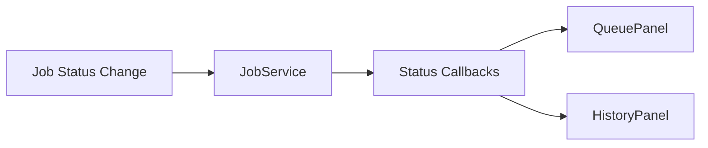

#CANONICAL
# StableNew Architecture (v2.5)

---

# Executive Summary (8–10 lines)

StableNew v2.5 provides a unified, predictable, testable pipeline from GUI → Controller → Pipeline Merging → Job Normalization → Queue → Runner → WebUI.  
The architecture eliminates legacy inconsistencies (V1 MainWindow, old job model, V1 runner) and replaces them with modular, well-typed components.  
The heart of the system is the **ConfigMergerV2 → JobBuilderV2 → NormalizedJobRecord** path, enabling consistent job construction regardless of GUI state or randomization.  
All pipeline execution flows through the **Queue-first architecture**, where JobService mediates job state, ordering, execution, and lifecycle.  
This document defines: subsystem responsibilities, data model definitions, execution flow, stage ordering, error handling, and deprecated concepts.  
It also includes a TLDR section for agents/users, detailed diagrams (Mermaid + ASCII), and reconciliation notes from earlier architecture versions.  

---

# PR-Relevant Facts (Quick Reference)

- **Only this document** defines the authoritative StableNew architecture.  
- Canonical pipeline construction path:  
  **RunConfigV2 → ConfigMergerV2 → JobBuilderV2 → NormalizedJobRecord → JobService/Queue → Runner → WebUI**  
- Canonical stage order:  
  **txt2img → img2img → refiner → hires → upscale → adetailer**  
- GUI V2 is panelized; MainWindow V1 architecture is deprecated.  
- Queue-first model: *all executions* flow through JobService except explicit direct mode.  
- Randomizer operates **before job normalization**, never inside the runner.  
- All override behavior must use **StageOverridesBundle** + **ConfigMergerV2 rules**.  
- Agents should ignore any document not marked `#CANONICAL`.  

---

# ============================================================
# 0. BLUF / TLDR — Concise Architecture Summary (Option C Layer)
# ============================================================

This section serves as a *top-of-file quick scan* for humans and LLMs.  
It is intentionally concise and represents the distilled structure of StableNew.

---

## **0.1 High-Level System Overview**

StableNew consists of four major layers:

1. **GUI (V2 Panels + AppStateV2)**  
   - User manipulates pipeline configs, prompt packs, randomizer controls, output settings, and queue.

2. **Controller Layer (PipelineControllerV2 + AppController)**  
   - Central coordinator.  
   - Collects GUI state and transforms it into complete pipeline instructions.

3. **Pipeline Builder Layer**  
   - `ConfigMergerV2`: merges pack configs + stage overrides.  
   - `JobBuilderV2`: expands variants, seeds, batches, and produces *NormalizedJobRecord* objects.

4. **Execution Layer**  
   - `JobService` + `JobQueueV2` manage ordering, auto-run, state transitions.  
   - Runner executes jobs (SingleNodeJobRunner or remote/WebUI).

Everything feeds into the **NormalizedJobRecord**, the canonical representation of a job.

---

## **0.2 TLDR Pipeline Flow Diagram (Mermaid)**

```mermaid
flowchart TD
    GUI[GUI Panels (Pipeline Tab)]
    AS[AppStateV2]
    PC[PipelineControllerV2]
    CM[ConfigMergerV2]
    JB[JobBuilderV2]
    NJR[NormalizedJobRecord]
    JS[JobService / Queue]
    RN[Runner]
    WU[WebUI]

    GUI --> AS --> PC
    PC --> CM --> JB --> NJR --> JS --> RN --> WU
ASCII fallback:
markdown
Copy code
GUI → AppState → PipelineController
      ↓
  ConfigMergerV2 → JobBuilderV2 → NormalizedJobRecord → JobService/Queue → Runner → WebUI
0.3 TLDR Stage Ordering
StableNew guarantees the following pipeline ordering:

txt2img

img2img (optional)

refiner (optional)

hires fix (optional)

upscale (optional)

adetailer (optional)

No PRs, GUI features, or randomization behaviors may alter this ordering.

0.4 TLDR Job Normalization
A job is only valid after it is normalized:
nginx
Copy code
Raw GUI State → Merged Config → Expanded Variants → NormalizedJobRecord
NormalizedJobRecord includes:

Final merged and expanded pipeline config

Fully resolved seed

Batch index and variant index

Output settings

Timestamps

PR-ready config_snapshot

This ensures consistency between GUI preview, queue view, and executed pipeline.

### 4.6 Unified Job Summary Layer (NormalizedJobRecord → Queue/History → Preview)

- A `UnifiedJobSummary` is derived from each `NormalizedJobRecord` and tagged with the current `JobStatus`.
- JobService stamps every `Job` with the summary built from the normalized snapshot before emitting status callbacks.
- PreviewPanelV2, QueuePanelV2, and HistoryPanelV2 consume the summary instead of ad-hoc dicts so that the prompt preview, stage list, model name, and image counts stay identical across lifecycle transitions.
- Summary fields include: positive/negative preview strings, stage chain, expected images, model name, and creation timestamp, making replay, history, and debugging deterministic.

This keeps the GUI aligned with the canonical job representation while avoiding duplicated metadata in every panel.

0.5 TLDR Queue Model
All pipeline execution passes through:

nginx
Copy code
JobService → JobQueueV2 → Runner
Queue is responsible for:

Ordering

Adding/removing jobs

(Planned) persistence

Auto-start

Pause/resume

The GUI simply visualizes queue state; it does not implement queue behavior.

0.6 TLDR Randomizer Placement
RandomizerEngineV2 executes before normalization:

nginx
Copy code
MergedConfig → RandomizationPlanV2 → VariantConfigs → JobBuilderV2 normalization
Randomizer never operates inside:

Runner

JobService

WebUI

0.7 TLDR Glossary (Short)
Concept	Meaning
RunConfigV2	Base pipeline config before merging or expansion
StageOverridesBundle	Set of user-chosen override flags + override values
ConfigMergerV2	Merges pack config + overrides into merged pipeline config
JobBuilderV2	Performs variant expansion, batch expansion, seed handling
NormalizedJobRecord	Final job definition used by queue & execution
JobService	Manager of job lifecycle, queue state, execution triggers
RandomizationPlanV2	Structured plan controlling config-level randomization

=================================================================
1. Full Canonical Architecture (Option A — Detailed Specification)
=================================================================
This is the authoritative section for PRs, designs, and agent reasoning.

1. High-Level System Overview
StableNew v2.5 is designed around modular, isolated subsystems:

GUI Layer controls UI and state presentation.

Controller Layer mediates between GUI and pipeline.

Pipeline Builder Layer ensures deterministic job construction.

Execution Layer handles queuing and running jobs.

External Systems (WebUI, model servers, storage) perform the underlying image generation.

Primary design principles:

Determinism

Immutability of normalized jobs

Testability

Strict subsystem boundaries

Canonical flow enforced by architecture

2. GUI Architecture (V2 Panels + AppState)
StableNew V2 GUI is panel-based, contrasting sharply with V1’s monolithic MainWindow.

Components:
Pipeline Tab Panels

CoreConfigPanel

Stage-specific panels (Refiner, Hires, Upscale, ADetailer)

RandomizerPanel

Output/Filename configuration

Prompt Pack selection + preview

PreviewPanelV2

QueuePanelV2

RunControlsPanelV2

AppStateV2
Stores:

Current selections

  Override bundles

  RandomizationPlanV2

  Output settings

  Draft job list

  Queue view models

  The Add-to-Job vertical slice (PR-C) keeps the draft bundle entirely inside `AppStateV2.job_draft` and relies on the PipelineController helpers (`add_single_prompt_to_draft`, `get_preview_jobs`, `enqueue_draft_bundle`) to keep PreviewPanelV2, QueuePanelV2, and JobHistoryPanelV2 synchronized without duplicating job state.

  GUI must not perform pipeline, merging, or job construction logic.

The Pipeline tab arranges the three primary columns (pack/config sidebar, stage cards, preview/queue + running job) so that each column is rooted inside a single `ScrollableFrame`, keeping column-level scrollbars and consistent card stacking. `MainWindowV2` applies default geometry/minimum-width constants so that all three columns are visible on launch without horizontal clipping.

3. Controller Architecture
3.1 PipelineControllerV2
Central responsibilities:

Read all relevant GUI state

Construct merged configs via ConfigMergerV2

Build job lists via JobBuilderV2

Submit jobs to JobService in the correct mode (queue/direct)

Forward normalized jobs to PreviewPanelV2

Enforce stage ordering rules

Coordinate Restore Last Run behavior

Dispatch UI updates on state changes

PipelineController is stateless except for the connection to AppStateV2.

4. Pipeline Construction Layer
The pipeline builder layer ensures that job construction is:

Deterministic

Testable

Independent of GUI

Fully normalized

It includes two components: ConfigMergerV2 and JobBuilderV2. Controllers now feed these builders through the canonical job-intent model introduced in PR-B: `PipelineConfigSnapshot`, `JobPart`, `JobBundle`, and `JobBundleBuilder`. GUI/Controller code expresses user intent (prompts, packs, overrides, output settings) as a `JobBundle` before handing it to `JobBuilderV2`, which keeps preview/queue/runner behavior aligned.

5. ConfigMergerV2 — Override & Merge Logic
Inputs:
Prompt Pack config

StageOverridesBundle (GUI-derived)

Outputs:
A MergedRunConfig representing the final configuration for a single variant before randomization/seeding.

Rules:
Overrides apply only when override flag is TRUE.

Disabled stages remain disabled, even if pack config enables them.

Nested configs (refiner, hires, adetailer) merge field-by-field.

No mutation of pack config or overrides.

Returns deep copies for safety.

Mermaid Diagram
mermaid
Copy code
flowchart LR
    PackCfg[Pack Config]
    Overrides[StageOverridesBundle]
    Merger[ConfigMergerV2]
    MergedCfg[MergedRunConfig]

    PackCfg --> Merger
    Overrides --> Merger
    Merger --> MergedCfg
ASCII:

vbnet
Copy code
PackConfig + Overrides → ConfigMergerV2 → MergedRunConfig

### 4.4 Unified Prompt & Config Resolution Layer (JobBundle → Runner)

All prompt/config combinations must flow through the new `src/pipeline/resolution_layer.py` helpers before they reach the queue or runner. The layer exposes:

- **UnifiedPromptResolver** – it deterministically merges prepend text, GUI prompt fields, prompt pack text, pack negatives, preset defaults, and the global negative toggle into a single `ResolvedPrompt`. It also trims values for preview DTOs and flags whether global penalties were applied.
- **UnifiedConfigResolver** – it consumes a `PipelineConfigSnapshot`, stage toggle flags, batch/seed metadata, and any randomizer summary to emit a `ResolvedPipelineConfig` whose `stages` map mirrors the runner’s canonical order and whose `final_size` reflects what `JobBuilderV2` will actually execute.

`JobBundleBuilder`, the preview DTOs, and the controller’s queue/history wiring all draw from these resolved objects so Preview = Queue = Runner, stage summaries never drift, and history snapshots can be replayed with confidence.

Because the resolver layer is pure and centralized, every new prompt or config path must reuse it; no GUI code may assemble prompts or stage configs outside this layer.

PipelineController now exposes dedicated helper APIs (`get_gui_model_defaults` and `build_merged_config_for_run`) that wrap `ModelDefaultsResolver`/`GuiDefaultsResolver`. GUI panels call `get_gui_model_defaults` whenever the selected model or preset changes so stage cards can be seeded with profile-driven refiner/hires defaults, while job/queue builders call `build_merged_config_for_run` to ensure the payload sent to the pipeline runner contains the same defaults the GUI displayed.

6. JobBuilderV2 — Variant, Batch, and Seed Expansion
JobBuilderV2 translates merged configs into a set of normalized jobs.

Responsibilities:
Apply RandomizationPlanV2 → produce variant configs

Expand batch runs

Calculate deterministic seeds (none / fixed / per-variant)

Assign variant_index, batch_index

Attach OutputSettings

Produce NormalizedJobRecord objects

Mermaid Diagram
mermaid
Copy code
flowchart TD
    MR[ MergedRunConfig ]
    RP[ RandomizationPlanV2 ]
    JB[ JobBuilderV2 ]
    VCFG[ Variant Configs ]
    NJR[ NormalizedJobRecord List ]

    MR --> JB
    RP --> JB
    JB --> VCFG --> NJR
ASCII:

css
Copy code
MergedConfig + RandomizationPlan → JobBuilderV2 → [NormalizedJobRecord...]
7. NormalizedJobRecord (Canonical Job Model)
Represents exactly what will run.
No GUI artifacts. No optional fields missing.

Fields include:
job_id

full pipeline config

seed

variant index / total

batch index / total

output directory

filename template

config_snapshot

timestamp

human-readable summary (JobUiSummary)

Why normalization is essential:
Eliminates GUI ambiguity

Ensures queue and preview are identical

Enables persistence

Prevents inconsistent executions

Guarantees reproducibility for Learning/Cluster phases

 8. Queue & Execution Layer
- Queue Model (JobService + JobQueueV2)
    - JobService now forwards completed and failed job signals to JobHistoryService so the history store consistently records metadata and emits completion events.
    - Each `Job` stores a deterministic JSON snapshot (via `src/utils/snapshot_builder_v2.py`) and `JobHistoryEntry.snapshot` keeps it in the history store so every run carries the merged config, normalized job, prompts, seeds, stage flags, and run metadata for later replay.
- JobHistoryService exposes a `replay_job_from_history` flow (`AppController`/`PipelineController` rehydrate the normalized job from the snapshot, re-populate the preview list, and submit it again through `_to_queue_job` → `JobService.submit_job_with_run_mode`), making every historical job reproducible without touching runner/pipeline internals.
- JobService now subscribes to queue status transitions and re-emits `job_started`, `job_finished`, and `job_failed` events so GUI panels and the history subsystem can react to deterministic lifecycle updates.
- Controllers (AppController, PipelineController, API surfaces) must submit every normalized job through JobService so _execute_job runs via the configured `runner_factory`. That DI path enforces the canonical flow: NormalizedJobRecord → JobService → JobQueue → SingleNodeJobRunner (with `_execute_job` as `run_callable`) before touching WebUI, which keeps queue-first semantics intact.
Add jobs

Remove jobs

Reorder jobs

Auto-run

Pause/resume

Track running job

(Planned) persist queue across restarts

Runner
Default runner: SingleNodeJobRunner

Responsibilities:

Execute pipeline stages in canonical order

Report progress & errors

Save images to output dir

Handle cancellation

Execution Mermaid Diagram
mermaid
Copy code
flowchart LR
    NJR[NormalizedJobRecord]
    JS[JobService]
    Q[JobQueueV2]
    RN[Runner]
    IMG[Generated Images]

    NJR --> JS --> Q --> RN --> IMG
ASCII:

nginx
Copy code
NormalizedJobRecord → JobService → Queue → Runner → Output Images
9. Stage Ordering Rules
Canonical order (mandatory):

txt2img

img2img

refiner

hires

upscale

adetailer

The runner must:

Skip disabled stages

Pass outputs sequentially

Preserve metadata between stages

10. Randomizer Integration Point
Randomizer runs before JobBuilderV2:

nginx
Copy code
MergedConfig → RandomizationPlanV2 → VariantConfigs → Normalization
Randomizer modifies the configuration, not:

seeds (except seed mode)

prompts

files

queue order

11. Output Model
StableNew uses:

OutputSettings

Filename templates with tokens

Output directories per job

JobBuilderV2 attaches OutputSettings to NormalizedJobRecord.

Runner writes results accordingly.

12. Error Handling & Cancellation
Jobs may fail at:

Merge stage

JobBuilder

Queue entry

Runner execution

Failures must:

Mark job as failed

Never crash GUI

Be visible in queue view

Produce a log entry visible in the Details panel

============================================================
13. JobDraft / JobBundle Ownership & Lifecycle (PR-D)
============================================================

### 13.1 Draft Bundle Pattern

StableNew implements a **controller-owned draft bundle pattern** for accumulating multi-part jobs before submission to the queue.

**Design Principles:**
- PipelineController owns `_draft_bundle` (JobBundle) and `_job_bundle_builder` (JobBundleBuilder)
- Draft bundles accumulate multiple JobParts (prompts) before enqueueing
- Preview panel displays draft summary via `JobBundleSummaryDTO`
- "Add to Job" button adds parts to draft without enqueueing
- "Add to Queue" button enqueues draft and clears it
- Draft state is ephemeral (not persisted across sessions)

### 13.2 Draft Bundle Lifecycle

```mermaid
flowchart LR
    GUI[GUI: Add to Job]
    PC[PipelineController]
    BUILDER[JobBundleBuilder]
    DRAFT[Draft Bundle]
    DTO[JobBundleSummaryDTO]
    PREVIEW[PreviewPanel]
    QUEUE[JobService/Queue]

    GUI --> PC
    PC --> BUILDER
    BUILDER --> DRAFT
    DRAFT --> DTO
    DTO --> PREVIEW
    PC --> QUEUE
```

**ASCII Flow:**
```
"Add to Job" → add_job_part_from_current_config() → JobBundleBuilder → _draft_bundle
_draft_bundle → get_draft_bundle_summary() → JobBundleSummaryDTO → PreviewPanel.update_from_summary()
"Add to Queue" → enqueue_draft_bundle() → JobService.enqueue() → clear draft
```

### 13.3 Key Methods

**PipelineController Draft Bundle API:**
- `add_job_part_from_current_config() -> JobBundleSummaryDTO | None`: Adds single prompt to draft
- `add_job_parts_from_pack(pack_name) -> JobBundleSummaryDTO | None`: Adds pack prompts to draft
- `get_draft_bundle_summary() -> JobBundleSummaryDTO | None`: Returns DTO for preview display
- `clear_draft_bundle()`: Clears draft and resets builder
- `enqueue_draft_bundle() -> str | None`: Submits draft to queue, clears draft, returns job_id

**Design Rationale:**
- DTO-based public API prevents external code from mutating draft state
- Controller encapsulates all draft logic (no GUI knowledge of JobBundle internals)
- Builder is lazy-initialized from GUI state on first add operation
- Builder is reused across add operations to maintain config consistency
- Enqueue converts JobParts → PipelineConfig → Job → JobService.enqueue()
- Clear operation resets both bundle and builder for fresh start

### 13.4 Integration with Queue and History

**Status Callback Flow:**


**AppController registers status callback:**
```python
def _on_job_status_for_panels(job: Job, status: JobStatus):
    if status in (QUEUED, RUNNING):
        queue_panel.upsert_job(JobQueueItemDTO.from_job(job))
    elif status in (COMPLETED, FAILED):
        queue_panel.remove_job(job.job_id)
        history_panel.append_history_item(JobHistoryItemDTO.from_job(job))
```

**Lifecycle Stages:**
1. Draft accumulation (PipelineController)
2. Enqueue to queue (JobService)
3. Queue display (QueuePanelV2)
4. Execution (Runner)
5. History recording (HistoryPanelV2)

### 13.5 Testing Strategy

**Unit Tests** (test_pipeline_controller_jobbundle_lifecycle.py):
- Draft bundle operations (add, clear, enqueue, get_summary)
- Edge cases (empty prompts, whitespace, no state)
- Error handling (missing config, builder failures)
- DTO validation (field presence, truncation, positive values)

**Integration Tests** (test_preview_queue_history_flow_v2.py):
- Add to job → preview updates
- Enqueue → queue updates, preview clears
- Job status callbacks → queue/history panel updates
- End-to-end workflows (multi-job, clear-and-restart)

**Coverage:**
- 29 unit tests for draft bundle lifecycle
- 13 integration tests for preview→queue→history flow
- All tests passing with 100% draft bundle API coverage

============================================================
14. Deprecated Concepts and Why They Changed
============================================================
#ARCHIVED
(This section is for historical context only. Agents must ignore.)

13.1 V1 Job Model
Unstructured

Not normalized

GUI-modified configs mid-run

No reproducibility

Replaced entirely by NormalizedJobRecord

13.2 MainWindow V1 Architecture
~7,380 lines, monolithic

Not testable

UI tightly coupled to pipeline logic

Replaced by modular panel-based GUI V2

13.3 Legacy Runner / Execution Path
Old flow:

nginx
Copy code
GUI → Executor → Direct WebUI Calls
Issues:

No queue

No job metadata

Hard to cancel jobs

No variant/batch tracking

No randomizer support

Replaced by:

nginx
Copy code
NormalizedJobRecord → JobService → Queue → Runner → WebUI
End of ARCHITECTURE_v2.5.md
