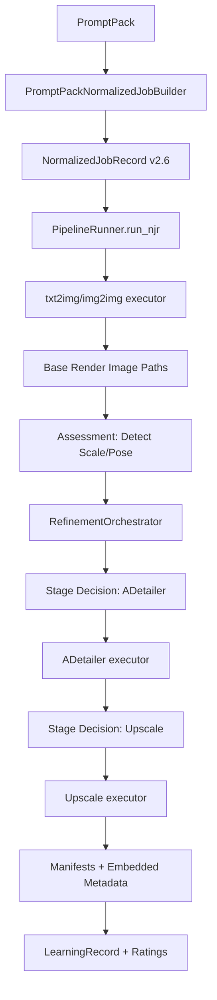
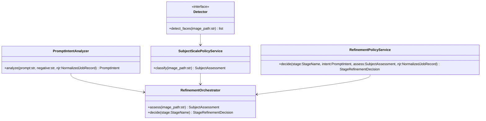

# StableNew Adaptive Refinement and Smart‑Prompting System Spec

## Executive summary

**What I had to learn to answer well**

- I needed to map the current StableNew execution path from PromptPack → NJR → PipelineRunner → stage executors, including where per-stage config and prompts are built and where manifests/metadata are written. fileciteturn51file0L1-L1 fileciteturn47file0L1-L1 fileciteturn52file0L1-L1  
- I needed to understand the v2.6 config/NJR contract (layering, `intent_config`, `backend_options`) so I could add “adaptive refinement” without re‑introducing legacy, backend-specific wiring. fileciteturn50file0L1-L1 fileciteturn49file0L1-L1  
- I needed to locate the existing prompt intelligence components (prompt optimizer, bucket rules, classifier, embedding/LoRA parsing) to avoid duplicating logic and to define a clean interface for “intent extraction” and “runtime prompt rewriting.” fileciteturn52file0L1-L1 fileciteturn59file0L1-L1 fileciteturn60file0L1-L1 fileciteturn61file0L1-L1 fileciteturn66file0L1-L1  
- I needed to confirm how ADetailer and upscale are currently invoked, what knobs exist today, and what’s safe to tune per-image without breaking deterministic replay or WebUI payload validation. fileciteturn47file0L1-L1 fileciteturn52file0L1-L1  
- I needed to study the current metadata / artifact / learning record pipeline so scale/intent assessments and policy selections can be captured once and reused for replay, diagnostics, and automated tuning. fileciteturn53file0L1-L1 fileciteturn54file0L1-L1 fileciteturn55file0L1-L1 fileciteturn56file0L1-L1 fileciteturn69file0L1-L1 fileciteturn70file0L1-L1  

**What I’m proposing**

I’m specifying a StableNew-first (backend-agnostic) feature: an **Adaptive Refinement & Smart‑Prompting** system that (a) measures subject scale/pose from base renders, (b) infers user intent from prompt + PromptPack structure, (c) dynamically selects per-stage refinement policies (ADetailer / upscale / prompt overlays for LoRAs + embeddings), (d) records a complete decision trail in manifests for replay and learning, and (e) uses ratings + auto-metrics to tune policies over time.

Because web browsing is disabled in this environment, I cannot cite external primary sources (papers, official docs). I therefore ground the “current state” in the StableNew2 repo and treat algorithms and tuning approaches as an engineering specification and best-practice proposal, not as externally-verified claims.

## Current repo state and the seams I can safely extend

StableNew’s v2.6 execution path is NJR-centric. `PromptPackNormalizedJobBuilder` resolves PromptPack rows into `NormalizedJobRecord` objects, builds `stage_chain` entries (`StageConfig`), and uses `UnifiedPromptResolver.resolve_from_pack()` to produce a final positive prompt that already includes `<embedding:...>` and `<lora:...:...>` tokens. fileciteturn51file0L1-L1 fileciteturn49file0L1-L1 fileciteturn66file0L1-L1

At runtime, `PipelineRunner.run_njr()` builds a deterministic `RunPlan` from the NJR `stage_chain` and dispatches stages sequentially, piping prior stage outputs into the next stage. That structure is the correct place for per-stage and per-image adaptive decisions because it is already the orchestration layer (and it already distinguishes image stages from video stages). fileciteturn47file0L1-L1 fileciteturn48file0L1-L1

The refinement seams are explicit:
- ADetailer is assembled in the executor with a carefully controlled payload, including ADetailer always-on script args and a deliberate choice to **not** apply global prompt merges to ADetailer’s custom prompts (it inherits or overrides explicitly). This is the ideal insertion point for scale/pose-aware inpaint tuning and stage-scoped prompt overlays. fileciteturn52file0L1-L1  
- Upscale is executed either through “extra-single-image” upscaling or “img2img-based upscale,” and it already records manifests and stage history. This is the second major target for per-image policy banding. fileciteturn52file0L1-L1  
- Prompt optimization exists as a stage-agnostic service called inside the executor. My feature should wrap it (decide explicit overlays and rewrites), then let the existing optimizer handle ordering/dedup/bucketing as the last mile. fileciteturn52file0L1-L1 fileciteturn57file0L1-L1 fileciteturn58file0L1-L1 fileciteturn59file0L1-L1

Replay and learning are already built on durable metadata plumbing:
- Per-image manifests are embedded into output images using the v2.6 metadata contract, including `stage_history` chains and a strong hash-based payload encoding. fileciteturn53file0L1-L1  
- Artifacts are normalized through a v2.6 artifact contract (image vs video), which can be extended to include new “assessment/policy decision” blocks without changing artifact typing rules. fileciteturn54file0L1-L1  
- Learning records and the recommendation engine already support ratings, subscores, and evidence tiers; these can be extended with new context keys (scale band, pose band, intent tags, policy ID). fileciteturn55file0L1-L1 fileciteturn56file0L1-L1

CI already enforces at least one architecture boundary (“utils cannot import GUI”), and I will mirror that enforcement for the new refinement subsystem. fileciteturn62file0L1-L1

## Target design and wiring into NJR and the runner

**Design invariants**

I’m designing to these invariants:
- StableNew owns **intent**, **assessment**, **policy selection**, **manifests**, and **learning signals**.
- Backends (WebUI/AnimateDiff/SVD/Comfy) only *consume* policy outputs (prompts + stage config patches) and never become the source of truth.
- The system must support **per-image decisions** within a batch. Today, `PipelineRunner` uses one stage config dict for all images in a stage loop, so I must add controlled “per-image patching” inside those loops. fileciteturn47file0L1-L1

**New modules and file paths**

I recommend adding a dedicated subsystem so the feature is testable, guardable, and doesn’t leak into GUI:

- `src/refinement/intent/prompt_intent_analyzer.py`
- `src/refinement/detection/detector_protocols.py`
- `src/refinement/detection/face_detector_opencv.py` (optional dependency)
- `src/refinement/detection/face_detector_facexlib.py` (optional dependency)
- `src/refinement/scale/subject_scale_policy_service.py`
- `src/refinement/policy/refinement_policy_schema.py`
- `src/refinement/policy/refinement_policy_service.py`
- `src/refinement/runtime/refinement_orchestrator.py`
- `src/refinement/runtime/refinement_manifest.py`

I will keep these modules GUI-free and add an AST-based guard test analogous to `tests/utils/test_no_gui_imports_in_utils.py`. fileciteturn62file0L1-L1

**Core data contracts**

I’m specifying three primary dataclasses plus a small schema layer to keep everything serializable:

```python
from __future__ import annotations

from dataclasses import dataclass, field
from typing import Any, Literal

StageName = Literal[
    "txt2img", "img2img", "adetailer", "upscale",
    "animatediff", "svd_native", "video_workflow"
]

@dataclass(frozen=True, slots=True)
class PromptIntent:
    has_people: bool
    shot_hint: Literal["close", "medium", "wide", "unknown"] = "unknown"
    style_hint: Literal["photo", "anime", "illustration", "3d", "unknown"] = "unknown"
    quality_bias: Literal["low", "normal", "high"] = "normal"
    tags: tuple[str, ...] = ()        # e.g. ("portrait", "full_body", "couple")
    risk_flags: tuple[str, ...] = ()  # e.g. ("hands_important", "faces_important")
    conflicts: tuple[str, ...] = ()   # emitted by conflict detection

@dataclass(frozen=True, slots=True)
class SubjectAssessment:
    image_path: str
    image_width: int
    image_height: int
    face_count: int = 0
    primary_face_bbox: tuple[int, int, int, int] | None = None  # x,y,w,h
    primary_face_confidence: float | None = None
    face_scale_band: Literal["none", "tiny", "small", "medium", "close"] = "none"
    pose_band: Literal["unknown", "frontal", "three_quarter", "profile"] = "unknown"
    reliability: float = 0.0  # 0..1

@dataclass(frozen=True, slots=True)
class StageRefinementDecision:
    stage: StageName
    policy_id: str
    enabled: bool = True
    prompt_append: str = ""
    negative_append: str = ""
    prompt_rewrite_reason: str = ""
    config_patch: dict[str, Any] = field(default_factory=dict)
    notes: tuple[str, ...] = ()
```

**How I will store opt-in settings vs runtime decisions**

I do not recommend adding runtime assessment fields into `NormalizedJobRecord` itself because it is persisted as a “queue snapshot,” and runtime image-derived assessments are not known at enqueue-time. Instead, I’ll:
- keep **opt-in settings** in `NormalizedJobRecord.intent_config` (already in the snapshot), and
- store **assessments + decisions** in per-stage manifests plus run metadata / learning records for replay and tuning. fileciteturn49file0L1-L1 fileciteturn53file0L1-L1 fileciteturn69file0L1-L1 fileciteturn70file0L1-L1

This matches the current v2.6 separation: config layering is handled by `config_contract_v26` (`intent_config`, `execution_config`, `backend_options`), while per-run outcomes live in manifests and `run_metadata.json`. fileciteturn50file0L1-L1 fileciteturn69file0L1-L1

**Runner wiring: per-image patching and pass-through**

I will add one orchestrator call inside `PipelineRunner.run_njr()` for each image in the stage loop (starting with ADetailer and upscale):
- After a base image is produced (txt2img or img2img), compute (or reuse) `SubjectAssessment`.
- Before ADetailer, request a per-image `StageRefinementDecision(stage="adetailer")`.
- Apply the decision by patching the per-image config dict and applying stage-scoped prompt overlays before calling the executor.
- Stamp decision data into manifest payloads.

A key runner fix I will include: **pass-through semantics** when a stage is disabled per-image. Today, if `run_adetailer_stage()` returns `None`, that image falls out of the pipeline’s `current_stage_paths`. For adaptive control, per-image stage disabling must carry forward the input image path. fileciteturn47file0L1-L1

**Flow diagrams**





## Algorithms, thresholds, and policy banding

**Face scale banding thresholds**

The first measurable signal should be face bounding box scale. Because the repo already supports optional dependencies that include OpenCV and facexlib (via the `svd` extra), I can implement detection tiering: if optional deps aren’t installed, I drop to scale_band `"none"` and rely on prompt intent only. fileciteturn64file0L1-L1 fileciteturn68file0L1-L1

I recommend classifying scale using:
- `face_width_ratio = face_w / image_w`
- `face_area_ratio = (face_w*face_h)/(image_w*image_h)`

| Face scale band | Heuristic threshold | Expected behavior |
|---|---|---|
| close | width_ratio ≥ 0.30 or area_ratio ≥ 0.09 | ADetailer lighter; avoid over-inpainting |
| medium | 0.18–0.30 or 0.04–0.09 | Default ADetailer tuning |
| small | 0.08–0.18 or 0.01–0.04 | More sensitive detection; more context padding |
| tiny | < 0.08 or < 0.01 | Often better to be conservative or pass-through |

**Pose classification and “over the shoulder” failure mode**

For pose, I recommend a progressive strategy:
- If landmarks are available, estimate yaw and map to `frontal/three_quarter/profile`.
- If landmarks are not available, approximate via bbox aspect ratio + confidence trend, and record `pose_band="unknown"` when uncertain.

Over-shoulder/profile failure tends to need: slightly lower denoise, more padding, more mask blur, and fewer “symmetry” constraints in negative prompt overlays.

**ADetailer presets per band**

StableNew’s ADetailer payload uses keys like `adetailer_confidence`, `ad_mask_k_largest`, `ad_mask_min_ratio`, `ad_inpaint_only_masked_padding`, `adetailer_steps`, `adetailer_cfg`, and `adetailer_denoise`. This is the knob set my policy system should output as `config_patch`. fileciteturn52file0L1-L1

| Band | Patch highlights | Expected effect |
|---|---|---|
| close | confidence↑, denoise↓, steps↓ | Prevents over-processing; keeps identity consistent |
| medium | defaults | Balanced face improvements |
| small | confidence↓, padding↑, steps↑, mask_min_ratio↓ | Detects small faces; gives context |
| tiny | enabled=False (per-image pass-through) | Avoids facial hallucination on distance |

**Auto-selection logic based on bounding box size**

When the face bbox is small, I will lower `adetailer_confidence` and `ad_mask_min_ratio` while increasing padding, then record the decision. This requires per-image patching inside the ADetailer stage loop in `PipelineRunner`. fileciteturn47file0L1-L1

```python
def adetailer_patch_for_face(scale_band: str, pose_band: str, face_count: int) -> dict[str, Any]:
    patch: dict[str, Any] = {}

    if scale_band == "close":
        patch |= {"adetailer_confidence": 0.45, "adetailer_denoise": 0.28, "adetailer_steps": 12}
    elif scale_band == "medium":
        patch |= {"adetailer_confidence": 0.35, "adetailer_denoise": 0.32, "adetailer_steps": 14}
    elif scale_band == "small":
        patch |= {
            "adetailer_confidence": 0.28,
            "adetailer_denoise": 0.30,
            "adetailer_steps": 16,
            "ad_inpaint_only_masked_padding": 48,
            "ad_mask_min_ratio": 0.004,
            "ad_mask_k_largest": 2 if face_count > 1 else 1,
        }
    else:
        patch |= {"__policy_disable_stage__": True}  # runner-only hint

    if pose_band == "profile":
        patch["adetailer_denoise"] = min(0.30, float(patch.get("adetailer_denoise", 0.32)))
        patch["ad_mask_blur"] = max(6, int(patch.get("ad_mask_blur", 6)))
        patch["ad_inpaint_only_masked_padding"] = max(48, int(patch.get("ad_inpaint_only_masked_padding", 32)))

    return patch
```

## Smart-prompt synergy, intent extraction, and conflict detection

**Intent extraction strategy**

StableNew already provides prompt splitting (comma-safe), keyword buckets, and deterministic PromptPack prompt assembly. I will re-use these to compute stable intent tags and “what matters” flags (faces/hands importance, shot distance, style bias). fileciteturn57file0L1-L1 fileciteturn58file0L1-L1 fileciteturn60file0L1-L1 fileciteturn66file0L1-L1

Minimal intent rules:
- `has_people`: true if subject markers are present or if prompt contains face/portrait terms.
- `shot_hint`: close if positive contains “close-up/portrait/headshot/85mm/bokeh”; wide if “full body/wide shot/long shot.”
- `style_hint`: inferred from positive style tokens and negative style blockers.

**Conflict detection: embeddings/LoRAs vs prompt**

LoRAs and embeddings are represented in-string as `<lora:NAME:WEIGHT>` and `<embedding:NAME>` (weighted or not). StableNew already has embedding parsing helpers; I will add LoRA parsing and build conservative conflict flags. fileciteturn61file0L1-L1 fileciteturn66file0L1-L1

Default behavior should be “warn and record,” not “silently rewrite.” An opt-in flag in `intent_config` can permit automatic conflict resolution later.

**Runtime prompt overlays (stage-scoped)**

I recommend adding prompt overlays **per stage**, not globally:
- ADetailer overlay: add face-detail tokens only when assessment indicates face is small or pose is challenging.
- Upscale-as-img2img overlay: add mild sharpness/detail tokens for small faces, avoid style shifts.

Executor already records `original_prompt/final_prompt` and runs prompt optimization per stage, so the system will preserve both the raw stage-scoped prompt and the optimized final payload. fileciteturn52file0L1-L1

```python
def prompt_overlay_for_adetailer(intent: PromptIntent, assess: SubjectAssessment) -> tuple[str, str, str]:
    if not intent.has_people:
        return ("", "", "no_people")

    if assess.face_scale_band in {"small", "tiny"}:
        return ("sharp face, detailed eyes, natural skin texture",
                "blurred face, distorted eyes",
                "small_face_detail_overlay")

    if assess.pose_band == "profile":
        return ("natural profile face, consistent features",
                "asymmetrical face, melted face",
                "profile_face_overlay")

    return ("", "", "no_overlay")
```

## Metadata, replay, evaluation, and automated tuning loop

**Manifest augmentation schema**

StableNew already embeds a structured payload (v2.6) into output images and propagates stage history. I’m proposing a stable sub-document attached to per-stage manifests so it can be extracted later for replay and learning. fileciteturn53file0L1-L1

```json
{
  "adaptive_refinement": {
    "schema": "stablenew.adaptive_refinement.v1",
    "intent": {
      "has_people": true,
      "shot_hint": "wide",
      "style_hint": "photo",
      "tags": ["full_body"],
      "risk_flags": ["faces_important"],
      "conflicts": []
    },
    "assessment": {
      "face_count": 1,
      "face_scale_band": "small",
      "pose_band": "three_quarter",
      "primary_face_confidence": 0.62,
      "reliability": 0.74
    },
    "decision": {
      "stage": "adetailer",
      "policy_id": "adetailer_smallface_v1",
      "enabled": true,
      "config_patch": {
        "adetailer_confidence": 0.28,
        "adetailer_steps": 16,
        "ad_inpaint_only_masked_padding": 48
      },
      "prompt_overlay": {
        "append": "sharp face, detailed eyes, natural skin texture",
        "negative_append": "blurred face, distorted eyes",
        "reason": "small_face_detail_overlay"
      }
    }
  }
}
```

Where it lives:
- In per-stage manifest JSON (already written under `manifests/` and referenced by the artifact contract). fileciteturn52file0L1-L1 fileciteturn54file0L1-L1  
- In the embedded metadata payload produced from manifests so it can be extracted with `extract_embedded_metadata()` later. fileciteturn53file0L1-L1  

**Outcome metrics and ratings**

StableNew already supports ratings and subscores in learning records, plus evidence tiers in the recommendation engine. I will attach “adaptive_refinement context” fields (scale_band, pose_band, policy_id, tags) to rated records to enable segmented analysis. fileciteturn55file0L1-L1 fileciteturn56file0L1-L1

Suggested automated proxies (tiered by available deps):
- Detection success rate per stage (`face_detected_after_txt2img`, `face_detected_after_adetailer`).
- Sharpness estimate on face crops (OpenCV Laplacian variance if available; else a PIL-based approximation).
- “Prompt churn” proxies from the prompt optimizer sidecar (dropped duplicate counts, bucket distributions) for diagnosing overly noisy prompts. fileciteturn52file0L1-L1

**Tuning ladder**

I recommend a conservative tuning ladder:
- Preset-based selection first (few curated policies).
- Small grid tuning second (confidence/denoise/padding bounds).
- Bayesian/bandit third (treat presets as arms per context bucket).

This aligns with the existing recommendation engine design, which already weights context and separates evidence tiers. fileciteturn56file0L1-L1

## Tests, CI guards, and a migration PR plan

**Tests and CI guards**

I will add these tests without introducing GUI dependencies:
- `tests/refinement/test_no_gui_imports_in_refinement.py`: AST scan identical to the existing utils guard, applied to `src/refinement`. fileciteturn62file0L1-L1  
- Unit tests: intent extraction, scale banding, deterministic decisions.
- Pipeline integration test: verifies per-image patching + pass-through semantics in `PipelineRunner`.

Because mypy is configured with `ignore_missing_imports = false` and `strict = true`, I will avoid direct imports of optional deps (cv2, facexlib) and instead use lazy imports returning `Any`. fileciteturn64file0L1-L1

**Migration and PR plan**

I recommend shipping this as a sequence of small PRs so each is reviewable and low-risk:

- **PR-ARSP-001:** Add schema + subsystem skeleton + no-GUI-import guard test (no runtime behavior change).
- **PR-ARSP-002:** Add detector wrapper + scale banding service + unit tests (still no runner wiring).
- **PR-ARSP-003:** Add PromptIntentAnalyzer + conflict detection + unit tests.
- **PR-ARSP-004:** Wire into `PipelineRunner` with per-image patching + per-image pass-through semantics in ADetailer/upscale loops. fileciteturn47file0L1-L1
- **PR-ARSP-005:** Stamp decisions into manifests + embedded metadata payloads. fileciteturn53file0L1-L1
- **PR-ARSP-006:** Extend learning/recommendation context keys and add a minimal “policy effectiveness” report. fileciteturn55file0L1-L1 fileciteturn56file0L1-L1

**Short reviewer checklist**

- StableNew remains the owner of intent/policy/manifest; backends only consume decisions.
- New modules are GUI-free, verified by guard tests.
- Per-image decisions are deterministic given the same image + prompt + config (no RNG).
- Disabled per-image stages pass-through inputs so batch outputs remain stable in count/order.
- Manifests record: inputs, assessments, selected policy, patch, stage prompts (before/after).
- Optional detectors are guarded so CI without extras still passes mypy + tests.

**Suggested .md outputs**

- `docs/specs/AdaptiveRefinement_SmartPrompting_Spec.md` (this document)
- `docs/specs/AdaptiveRefinement_PolicySchema.md` (policy JSON schema + presets)
- `docs/specs/AdaptiveRefinement_ReviewerChecklist.md` (one-page checklist)
- `docs/specs/AdaptiveRefinement_TuningPlaybook.md` (metrics + tuning ladder + retention policy)

Spec MD link: [StableNew_Adaptive_Refinement_SmartPrompting_Spec.md](sandbox:/mnt/data/StableNew_Adaptive_Refinement_SmartPrompting_Spec.md)