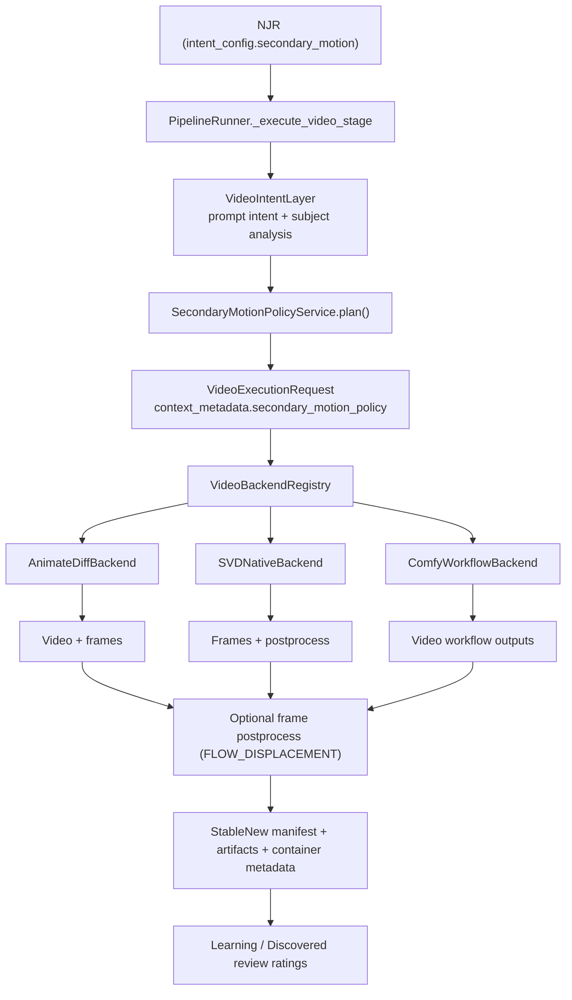
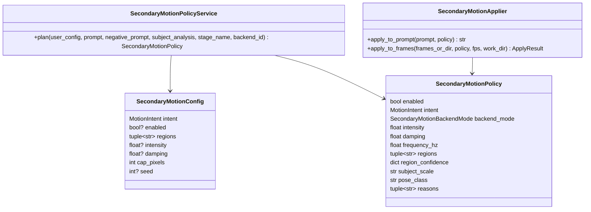

# StableNew Secondary Motion Layer Design

## Executive summary

StableNew already has the right architectural “seam” to introduce controllable secondary motion as a modular feature: video work is routed through `NJR -> Stage plan -> PipelineRunner -> VideoBackendRegistry -> backend.execute(request) -> artifacts/manifests`. The current implementation supports multiple canonical video stages (`animatediff`, `svd_native`, `video_workflow`) and routes them through `VideoExecutionRequest`—a StableNew-owned internal contract that already carries prompts, workflow IDs, backend options, and free-form `context_metadata`. fileciteturn108file0L1-L1 fileciteturn84file0L1-L1 fileciteturn79file0L1-L1 fileciteturn80file0L1-L1

That means “jiggle physics” (controllable soft-body / secondary motion) should be built as a StableNew-owned **Motion Augmentation Layer** that sits above backends, not inside prompt optimizer logic and not hardcoded into a specific backend. The “best” path (modular, controllable, replayable, learnable) is:

- Define a **SecondaryMotionConfig** (user intent) and a **SecondaryMotionPolicy** (chosen plan) that are persisted through NJR and written into manifests/container metadata.
- Add a **SecondaryMotionPolicyService** that combines prompt intent + subject scale/pose analysis (from your upcoming adaptive refinement system) to choose whether to run, with what intensity/damping/regions, and which backend integration mode to use.
- Implement a **cross-backend postprocess** (frame-space warp + damped spring model, optionally flow-guided) first, because it works for AnimateDiff, SVD, and Comfy-generated videos without requiring model training.
- Then add backend-native enhancements where they pay off most:
  - **Comfy/LTX**: add an optional StableNew-owned node / workflow branch that applies the motion augmentation before encoding video (best controllability).
  - **AnimateDiff**: optionally stack a motion LoRA / prompt injection as a low-cost mode; keep the deterministic postprocess as the “quality mode.”
  - **SVD**: extend the existing postprocess pipeline (it already supports subprocess worker stages) to include `secondary_motion` alongside face restore/interpolation/upscale. fileciteturn101file0L1-L1 fileciteturn112file0L1-L1

Finally, make it learnable by storing: (a) what you inferred, (b) what you applied, (c) derived metrics, and (d) user ratings—so your Learning/Discovered Review workflow can cluster and tune these knobs over time. fileciteturn113file0L1-L1

## What I need to learn to answer well

I need to understand how StableNew currently routes video jobs end-to-end (NJR → runner → backend) and what data is available at that seam (`VideoExecutionRequest`, stage config, prompts, anchors). fileciteturn84file0L1-L1 fileciteturn80file0L1-L1

I need to identify where StableNew already stores replay metadata and manifests (per-backend manifests + container metadata), because secondary motion must be reproducible and diagnosable. fileciteturn90file0L1-L1 fileciteturn91file0L1-L1

I need to see how each backend currently produces frames/videos (AnimateDiff frames directory + mp4 assembly, SVD in-memory frames + postprocess pipeline, Comfy workflow outputs + StableNew-owned manifest). fileciteturn100file0L1-L1 fileciteturn101file0L1-L1 fileciteturn81file0L1-L1

I need to confirm how prompt analysis tooling exists today (prompt chunk classification, bucket rules) so MotionIntent inference can reuse it without polluting the prompt optimizer. fileciteturn105file0L1-L1 fileciteturn106file0L1-L1 fileciteturn107file0L1-L1

I need to ensure the design preserves your “no backend leakage outside `src/video/`” invariant (especially for Comfy) and that tests/guards can enforce it. fileciteturn91file0L1-L1

I need to align this with your planned adaptive refinement system so “intent × reality × per-stage” decisioning is shared infrastructure, not duplicated heuristics.

## Current repo state relevant to secondary motion

### The v2.6 video seam is already in place

StableNew defines canonical stage types including the video stages you care about (`animatediff`, `svd_native`, `video_workflow`) and a canonical ordering that places video stages after image stages. fileciteturn108file0L1-L1

`PipelineRunner` executes video stages by building a `VideoExecutionRequest` and dispatching it through `VideoBackendRegistry`—meaning there is already a centralized orchestration point where a Motion Augmentation Layer can run before backend execution. fileciteturn84file0L1-L1 fileciteturn79file0L1-L1

`VideoExecutionRequest` already contains the fields that matter for motion policy decisions and backend mapping: `prompt`, `negative_prompt`, `motion_profile`, `workflow_id/version`, `workflow_inputs`, `backend_options`, and a general-purpose `context_metadata` dict that can carry derived analysis/policy without changing backend APIs. fileciteturn80file0L1-L1

### Each backend already yields the raw materials needed for a postprocess-first approach

AnimateDiff is executed through the WebUI pipeline and is assembled from per-frame images written to a frames directory, then encoded to mp4—with an existing manifest and container metadata write step where you can record motion policy decisions. fileciteturn100file0L1-L1

SVD native already has a structured config model with an explicit postprocess pipeline that runs optional stages (face restore, interpolation, upscale), implemented in a way that makes adding a new postprocess stage straightforward. fileciteturn101file0L1-L1 fileciteturn112file0L1-L1

Comfy/LTX workflow video already relies on a StableNew workflow registry/compiler and a StableNew-owned manifest, meaning you can extend the workflow inputs and/or add a StableNew-owned postprocess step while preserving replay semantics. fileciteturn82file0L1-L1 fileciteturn86file0L1-L1 fileciteturn91file0L1-L1

### StableNew already embeds media metadata in outputs

`src/video/container_metadata.py` builds a public embedded metadata payload for exported videos and includes job/run/stage identifiers plus prompt and `motion_profile`. This is the correct place to add *small* “secondary motion” values for convenient replay (while keeping heavier details in the manifest). fileciteturn90file0L1-L1

## Architecture for a modular Secondary Motion Layer

### Where this belongs

Your instinct is correct: secondary motion should sit at:

```text
PromptPack/NJR intent_config
    -> VideoIntentLayer (intent + subject analysis)
        -> SecondaryMotionPolicyService (decide)
            -> Backend execution (AnimateDiff / SVD / Comfy)
                + optional postprocess (frame warp)
                    -> StableNew manifests + learning signals
```

This matches the repo’s existing contract boundaries: NJR is the outer contract; `VideoExecutionRequest` is internal; backends are contained under `src/video/`; manifests are StableNew-owned; Comfy details are not allowed to leak out. fileciteturn91file0L1-L1 fileciteturn84file0L1-L1

### Core data models

Create a new module:

`src/video/motion/secondary_motion_models.py`

```python
from __future__ import annotations

from dataclasses import dataclass, field
from enum import Enum
from typing import Literal

class MotionIntent(str, Enum):
    OFF = "off"
    AUTO = "auto"
    SUBTLE = "subtle"
    NATURAL = "natural"
    ENHANCED = "enhanced"

class SecondaryMotionBackendMode(str, Enum):
    # cheapest / least deterministic
    PROMPT_ONLY = "prompt_only"
    LATENT_BIAS = "latent_bias"
    # deterministic / feature-grade
    FLOW_DISPLACEMENT = "flow_displacement"
    POSE_CONDITIONED = "pose_conditioned"

@dataclass(frozen=True, slots=True)
class SecondaryMotionConfig:
    """User intent (persisted in NJR intent_config and/or stage extra)."""
    intent: MotionIntent = MotionIntent.AUTO
    enabled: bool | None = None   # None = infer from intent, True/False = force
    regions: tuple[str, ...] = ("torso",)  # ["torso", "hips", "hair", "cloth"]
    intensity: float | None = None        # optional user override (0..1)
    damping: float | None = None          # optional override (0..1)
    cap_pixels: int = 12                  # safety clamp for warps
    seed: int | None = None               # for deterministic noise patterns

@dataclass(frozen=True, slots=True)
class SecondaryMotionPolicy:
    """Computed plan (written into manifests + request.context_metadata)."""
    enabled: bool
    intent: MotionIntent
    backend_mode: SecondaryMotionBackendMode

    # core physical-ish controls
    intensity: float          # 0..1 (maps to spring constant / amp)
    damping: float            # 0..1
    frequency_hz: float       # typical 0.8..2.5

    regions: tuple[str, ...]
    region_confidence: dict[str, float] = field(default_factory=dict)

    # analysis summary used for explain/replay
    subject_scale: str | None = None      # "close", "mid", "wide"
    pose_class: str | None = None         # "frontal", "profile", "over_shoulder"
    reasons: tuple[str, ...] = ()
```

This is deliberately backend-agnostic and can be stored inside:
- NJR `intent_config["secondary_motion"]` (user intent, stable contract)
- `VideoExecutionRequest.context_metadata["secondary_motion_policy"]` (derived plan) fileciteturn80file0L1-L1 fileciteturn109file0L1-L1

### SecondaryMotionPolicyService

Create:

`src/video/motion/secondary_motion_policy_service.py`

Key responsibilities:
- Read **prompt intent** (explicit motion phrases, domain/genre cues).
- Read **subject scale/pose** (from base image analysis—part of your upcoming adaptive refinement system).
- Decide:
  - enable/disable
  - intensity/damping/frequency
  - regions
  - backend mode selection (prompt-only vs bias vs deterministic postprocess)

Method surface:

```python
from __future__ import annotations

from dataclasses import asdict
from typing import Any

from src.video.motion.secondary_motion_models import (
    SecondaryMotionConfig,
    SecondaryMotionPolicy,
    MotionIntent,
    SecondaryMotionBackendMode,
)

class SecondaryMotionPolicyService:
    def plan(
        self,
        *,
        user_config: SecondaryMotionConfig | None,
        prompt: str,
        negative_prompt: str,
        subject_analysis: dict[str, Any] | None,
        stage_name: str,
        backend_id: str | None,
    ) -> SecondaryMotionPolicy:
        """
        Returns a deterministic policy. No side effects.
        Must be safe to serialize into manifests.
        """
        # 1) Normalize user intent
        # 2) Infer MotionIntent from prompt when AUTO
        # 3) Combine with subject scale & pose to choose intensity and regions
        # 4) Choose backend mode (postprocess-first; override per backend)
        ...
```

Where does `subject_analysis` come from? In your other spec you plan subject scale and pose detection. The video layer can consume that output—without creating a second analysis engine. That keeps “intent × reality” logic centralized.

### Wiring into existing StableNew flow

The cleanest wiring point is **inside `PipelineRunner._execute_video_stage`** (or a helper it calls), because this is where the `VideoExecutionRequest` is created and the backend is chosen. fileciteturn84file0L1-L1

High-level wiring:

1. Extract user motion intent config from NJR:
   - `record.intent_config.get("secondary_motion")` (recommended)
   - or `stage_config.extra.get("secondary_motion")` (acceptable per-stage override)

2. Run/obtain subject analysis from your adaptive refinement system (base render / anchor image).

3. Call `SecondaryMotionPolicyService.plan(...)`.

4. Attach policy:
   - `request.context_metadata["secondary_motion_policy"] = policy_as_dict`
   - possibly `request.backend_options["secondary_motion"] = ...` if a backend needs it
   - optionally add “prompt-only” augmentation via `request.prompt = rewritten_prompt` (but keep deterministic postprocess as default)

5. Ensure the chosen policy gets written into:
   - backend manifest fragments (`VideoExecutionResult.replay_manifest_fragment`)
   - container metadata payload (small summary) fileciteturn80file0L1-L1 fileciteturn90file0L1-L1

## Backend implementation options and what I’d recommend

### Comparing the three “jiggle physics” approaches as a StableNew feature

| Approach | Control & consistency | Engineering cost | Best fit in StableNew |
|---|---|---|---|
| Prompt-only illusion | Low; stochastic; breaks across frames | Low | Provide as a fallback mode, not the core feature |
| Latent motion bias (LoRA / motion module bias) | Medium; reproducible but implicit | Medium | Good “cheap mode” for AnimateDiff; optional for Comfy |
| Explicit secondary motion layer (flow/pose + spring) | High; deterministic and tuneable | Medium → High | Best “feature-grade” approach; implement postprocess-first |

### AnimateDiff in this repo

AnimateDiff is assembled from frame images saved to disk and then encoded to mp4, so you can insert a secondary motion step between “frames written” and “video assembled.” fileciteturn100file0L1-L1

Options:
- **Low-cost**: when policy.backend_mode ∈ {`PROMPT_ONLY`, `LATENT_BIAS`}, apply prompt rewrite and/or inject a motion LoRA token into the prompt.
- **Best**: `FLOW_DISPLACEMENT` postprocess: run a frame warper worker that writes corrected frames to a sibling folder, then encode mp4 from those frames; record the applied policy in the AnimateDiff manifest and container metadata.

Recommended integration point:
- Extend `Pipeline.run_animatediff_stage` to call `SecondaryMotionApplier.apply_to_frame_dir(...)` after `write_video_frames(...)` and before `VideoCreator.create_video_from_images(...)`. fileciteturn100file0L1-L1

### SVD native in this repo

SVD already has a typed postprocess pipeline with worker stage execution. This is the easiest place to implement deterministic secondary motion as a new optional stage, because it already:
- writes frames to disk,
- runs a subprocess worker to transform frames,
- reloads frames,
- continues through interpolation/upscale,
- and returns a structured `postprocess` metadata block. fileciteturn101file0L1-L1

Options:
- **Immediate**: add `SVDSecondaryMotionConfig` under `SVDPostprocessConfig` and implement a `secondary_motion` worker action alongside `face_restore` and `upscale`. fileciteturn112file0L1-L1
- **Later**: also map policy intensity to `SVDInferenceConfig.motion_bucket_id` / `noise_aug_strength` to increase/decrease overall motion “energy,” while the postprocess provides localized soft-body behavior. fileciteturn112file0L1-L1

Recommendation:
- Implement secondary motion as **postprocess stage #0** (before face restore/interpolation/upscale) so later stages operate on already-corrected motion.

### Comfy/LTX workflow backend in this repo

StableNew already owns a workflow catalog/spec and compiles requests using `WorkflowCompiler`, which can bind values from `VideoExecutionRequest` fields (including `context_metadata.*`). fileciteturn86file0L1-L1

Options:
- **Best-in-class**: extend the pinned workflow spec to accept a `secondary_motion` input binding (e.g., `context_metadata.secondary_motion_policy`) and route it into a StableNew-owned node (you already use StableNew-owned nodes like `StableNewLTXAnchorBridge` / `StableNewSaveVideo` in the pinned workflow approach). fileciteturn91file0L1-L1
- **Fast + cross-backend parity**: postprocess after Comfy outputs the video—extract frames via ffmpeg, apply the same deterministic warp worker, re-encode, then write container metadata and include a motion fragment in the StableNew-owned manifest.

Recommendation:
- Start with the **shared postprocess** so policy behavior is consistent across backends; then add the **workflow-native** path for LTX where you want maximum control and efficiency.

## Algorithms for scale/pose classification and policy banding

This feature becomes high-quality when it is **scale- and pose-aware**—the same insight you already captured for ADetailer/upscale selection. The goal is:

- avoid adding visible artifacts in close-up faces,
- avoid wasted work when the subject is tiny,
- avoid “rubbery” behavior when pose is extreme (e.g., over-shoulder/profile).

### Subject scale heuristics

These are robust even with simple detectors:

| Signal | How to compute | Bands (suggested defaults) | Used for |
|---|---|---|---|
| Face area ratio | face_bbox_area / image_area | close ≥ 0.05; mid 0.01–0.05; wide < 0.01 | reduce intensity near close-up faces |
| Person height ratio | person_bbox_h / image_h | close ≥ 0.65; mid 0.35–0.65; wide < 0.35 | decide if torso/hips motion is worth it |
| Region pixel budget | min(region_w, region_h) | disable if < 96 px | avoid noisy warps on tiny bodies |

These thresholds should be stored as data (policy preset) to support tuning.

### Pose class heuristics

You don’t need “perfect pose estimation” to get value. A staged approach:

- **Phase A** (cheap): face bbox geometry + eye distance ratio to classify `frontal` vs `profile`.
- **Phase B**: pose keypoints (shoulder/hip alignment) for `over_shoulder` detection.
- **Phase C**: motion-driven refinement (optical flow direction field and occlusion) once you have base frames.

Pose class influences:
- which regions to enable (e.g., torso only vs torso+hips),
- how hard to clamp displacement near silhouettes,
- how to damp motion when the body is partially occluded.

### The “physics” model that’s stable in production

For a production-grade deterministic “secondary motion” feel, you want a deliberately *simple* model:

- drive motion from a measured base signal (body movement / keypoint translation / optical flow),
- add lag + overshoot via a damped spring response,
- apply a smooth displacement field inside a region mask with feathered edges.

Spring update (discrete):

```text
v[t+1] = v[t] + dt * (k * (u[t] - x[t]) - c * v[t])
x[t+1] = x[t] + dt * v[t+1]
```

Where:
- `u[t]` is the driving motion (e.g., torso keypoint track or regional optical flow average),
- `x[t]` is the secondary displacement,
- `k` is stiffness (maps from intensity),
- `c` is damping (maps from policy damping).

Safety clamps (important):
- cap displacement in pixels (`cap_pixels` in config),
- cap velocity to prevent frame-to-frame tearing,
- reduce displacement near region boundaries (mask feather),
- freeze or greatly damp if pose confidence is low.

### Policy presets

Keep the UI simple while preserving a rich internal policy:

| UI preset | intensity | damping | freq (Hz) | cap px | Notes |
|---|---:|---:|---:|---:|---|
| Off | 0.0 | 1.0 | 0.0 | 0 | Not applied |
| Subtle | 0.20 | 0.75 | 1.0 | 4 | For realism / avoid distraction |
| Natural | 0.42 | 0.65 | 1.4 | 8 | Default “feature on” feel |
| Enhanced | 0.65 | 0.55 | 1.8 | 12 | Stylized but still plausible |

The policy service should also auto-scale these based on subject scale. Example: if face area ratio indicates close-up, multiply `cap_px` by 0.5 and raise damping.

## Replay, metadata, and learning loop

### What to persist (without bloating container metadata)

You already have a strong convention: keep the canonical truth in a StableNew manifest, and embed a compact “public payload” in the container. fileciteturn90file0L1-L1

Add a manifest section:

```json
{
  "motion": {
    "secondary_motion": {
      "user_config": { "intent": "auto", "regions": ["torso"], "cap_pixels": 12 },
      "policy": {
        "enabled": true,
        "backend_mode": "flow_displacement",
        "intent": "natural",
        "intensity": 0.42,
        "damping": 0.65,
        "frequency_hz": 1.4,
        "regions": ["torso"],
        "subject_scale": "mid",
        "pose_class": "frontal",
        "reasons": ["intent:auto", "torso_detected", "mid_shot"]
      },
      "runtime": {
        "frames_in": 25,
        "frames_out": 25,
        "worker": "secondary_motion_worker_v1",
        "output_frame_dir": "…/secondary_motion_output",
        "seed": 12345
      }
    }
  }
}
```

Then embed *only a summary* in container metadata (to stay under your soft limit and avoid truncation). fileciteturn90file0L1-L1

### Outcome metrics and auto-tuning hooks

Your learning system already has a roadmap for discovered review inbox + rating workflows. Secondary motion should feed into that, rather than create a separate tuning system. fileciteturn113file0L1-L1

Metrics to compute automatically per run (lightweight first):
- **Flow smoothness**: median optical flow magnitude variance across frames (spikes indicate “wobble/tearing”).
- **Edge tear score**: high gradient mismatch along region boundary after warp.
- **Landmark jitter** (optional): track a few facial landmarks; if jitter increases, reduce intensity near close-ups.
- **User rating**: 1–5 satisfaction; include a tag for “too much motion” vs “not enough” vs “artifacts.”

Learning loop:
- Store (prompt features, subject scale, pose class, backend, policy values, metrics, user rating).
- Group by discovered review engine on varying knobs like intensity/damping/backend_mode.
- Tune threshold tables and preset mappings via:
  - first: grid search on thresholds in an offline batch
  - later: Bayesian optimization over continuous params (intensity/damping/frequency), constrained by artifact score.

Privacy/data retention:
- Persist only derived box/keypoint summaries and policy choices in manifests by default.
- Store raw masks/frames only as paths inside the run folder (already user-owned), not duplicated into centralized logs.

## Implementation roadmap, PR plan, and reviewer checklist

### Phase roadmap

**Phase one (product-grade baseline)**  
A cross-backend deterministic postprocess, with fully recorded policy and replay, even if detectors are simple.

**Phase two (quality & control)**  
Region detection (pose/segmentation), better driving signals (flow), Comfy workflow-native mode.

**Phase three (model-native bias)**  
Optional motion LoRA stacks for AnimateDiff and Comfy; optional SVD tuning via inference params, possibly fine-tunes if you decide to train.

### Proposed PR sequence

**PR-MOTION-001: Contracts and policy service skeleton**
- Add `src/video/motion/secondary_motion_models.py`
- Add `src/video/motion/secondary_motion_policy_service.py`
- Add unit tests for policy banding behavior (no heavy deps).
- Wire policy into `VideoExecutionRequest.context_metadata` in `PipelineRunner` (no backend behavior change yet). fileciteturn84file0L1-L1 fileciteturn80file0L1-L1

**PR-MOTION-002: SVD postprocess integration**
- Extend `SVDPostprocessConfig` with `secondary_motion` config. fileciteturn112file0L1-L1
- Add a postprocess stage in `SVDPostprocessRunner.process_frames` (run before face restore). fileciteturn101file0L1-L1
- Implement `src/video/motion/secondary_motion_worker.py` (or extend `svd_postprocess_worker` with a new `action`).
- Add skip-safe tests (skip if cv2/torch not present), mirroring existing optional dependency patterns.

**PR-MOTION-003: AnimateDiff integration**
- Insert the motion worker between `write_video_frames(...)` and video encoding. fileciteturn100file0L1-L1
- Write applied policy into the AnimateDiff manifest + container metadata payload. fileciteturn100file0L1-L1 fileciteturn90file0L1-L1

**PR-MOTION-004: Comfy integration**
- Fast path: postprocess the produced mp4 by extracting frames, warping, re-encoding, updating manifest.
- Better path: extend the pinned workflow spec to accept `context_metadata.secondary_motion_policy` binding and add a StableNew-owned node path. fileciteturn86file0L1-L1 fileciteturn82file0L1-L1

**PR-MOTION-005: UI + config adapters**
- Add an “Secondary motion” selector: Off / Auto / Subtle / Natural / Enhanced.
- Persist into NJR `intent_config` (not backend config), so it is stable and shared across backends. fileciteturn109file0L1-L1
- Extend the video workflow controller form model to carry it. fileciteturn88file0L1-L1

### Reviewer checklist (short)

Confirm the feature is optional, deterministic, and replayable:
- The NJR captures the user intent (`intent_config.secondary_motion`) and manifests capture the derived policy and runtime results.
- No backend-specific APIs leak outside `src/video/` (especially no Comfy imports in controllers/GUI). fileciteturn91file0L1-L1
- The policy service is pure/side-effect-free and has tests.
- Warp intensity is clamped and pose/scale guards prevent obvious artifact cases.
- Container metadata includes only compact summaries (no giant blobs) to avoid truncation. fileciteturn90file0L1-L1
- Optional dependencies are handled via clean skips (tests do not fail collection when cv2/torch/etc are absent).

### Suggested design doc filenames

- `docs/design/Feature_SecondaryMotionLayer_v1.md`
- `docs/design/SecondaryMotionPolicyService.md`
- `docs/design/SecondaryMotionWorker_and_FrameWarp.md`

## Diagrams

### Pipeline flow



### Class relationships



## Note about external sources

You requested that I consult primary/official docs and papers via web search after analyzing the repo. In this environment, public web browsing is disabled by your connector settings, so I limited evidence to the StableNew2 repository artifacts and designed the feature to align tightly with your existing contracts and architecture.