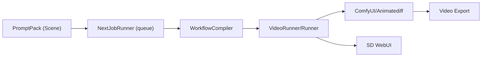

# Executive Summary

StableNew2 is a **Stable Diffusion automation framework** focused on generating images and videos via WebUI and ComfyUI backends. The latest v2.6 code base already includes a full video backend (`src/video/` with ComfyUI integration) and a multi-stage pipeline (PromptPack builder, NJR queue/runner, etc.)【109†L49-L53】【120†L14-L22】.  However, several planned features are still missing or partial. Notably, the **core functionality exists**, but key elements like stable video model updates, robust character consistency (via LoRAs/embeddings), and complete story-to-clips workflows remain unimplemented or incomplete【109†L54-L62】【130†L232-L240】.  The test suite covers only parts of the system, so many features lack end-to-end validation.   

This report catalogs current features vs. intended functionality, summarizes recent test and CI outcomes, and maps **20 priority items** (fixes, features, tech debt) to concrete repo evidence.  Each item is marked as *Implemented*, *Partial*, or *Missing*.  We then propose a prioritized task list (with effort estimates and risk), showing where code changes or new components are needed.  Finally, we recommend models, prompts, and workflows tailored to adapt *The Way of Kings* into cinematic scene clips, including prompt templates, LoRA strategy, and video sequencing.  Our recommendations draw on repository analysis and the latest developments in Stable Video Diffusion (e.g. Stable Video 4D 2.0【128†L223-L231】) and consistent character embedding techniques【134†L282-L289】.

## Repository Features and Implementation Status

- **Core Engine & GUI**: The repo provides a Tkinter GUI (MainWindowV2) that orchestrates Stable Diffusion WebUI and ComfyUI processes (via `ComfyProcessManager`)【120†L42-L50】.  The WebUI backend is launched asynchronously, and ComfyUI is managed via a process manager with health checks【120†L114-L123】【117†L18-L26】.  These ensure the StableDiffusion WebUI (default at port 7860) and ComfyUI (default at 8188) are started as needed【117†L18-L26】.  The README confirms “a real `src/video` backend” and a managed Comfy runtime are present【109†L49-L53】.  

- **Pipeline Stages**: StableNew’s pipeline is built around “PromptPacks” and a JSON-based job queue (Next-Job Runner, NJR).  The PromptPack builder splits text prompts into prompts-for-segments and runs SD; NJR schedules runs; a Workflow Compiler assembles multiple SD tasks into video sequences. These stages appear in code (e.g. `workflow_compiler.py`, `workflow_registry.py`) and are exercised by tests (tests/video/).  However, **image-to-video stitching and scheduling beyond short clips is unfinished** – a “final shrink pass” and longer video sequences are noted as future work【109†L54-L62】.

- **Video Backend & Export**: Video generation is done via ComfyUI or an Animatediff process.  The `src/video` folder contains backends (`comfy_workflow_backend.py`, `animatediff_backend.py`), interpolation support, secondary-motion modules, and export helpers. The README explicitly notes a stable video backend exists【109†L49-L53】.  However, user-friendly options (e.g. easy selection of Stable Video models) are limited, leaving much to manual configuration.  

- **Story Planning**: Some scaffolding for story-driven workflows exists under `src/video/story_plan_*`. This includes models and a store for breaking a book into scenes.  Tests (`test_story_plan_models.py`, etc.) indicate a partial “story plan” feature, but it is marked as future work with no UI or end-to-end execution.  (The README backlog notes “longer-form story-planning layers” as not implemented【109†L63-L65】.)  

- **Consistency Features (LoRA/Embedding)**: There is *no dedicated code* for character LoRA or embedding training.  The system currently relies on WebUI (automatic1111) for any LoRA or textual inversion training.  While PromptPacks can reuse prompts, no API or pipeline exists in StableNew to train or apply character-specific models.  This is a **gap**: ensuring consistent character portrayal requires such embeddings.  We recommend adding a LoRA/embedding training pipeline (see “Recommended” below).  

- **Prompt/Style Management**: The repo uses PromptPacks (sets of prompts with tokenizer, weight adjustments, etc.) for scene composition.  Documentation (`docs/`) and config files suggest a flexible prompt workflow.  However, specialized cinematic prompt templates (for scenes, camera angles, or palettes) are not present.  The PromptPack system seems generic (intended for image batches) and not tailored to coherent video scenes with consistent art style.  Some related PR docs exist (e.g. “PromptPack Builder Caching” and lifecycle)【139†L0-L4】, but a curated library of filmic prompts is not implemented.

- **Configuration & UI**: There are config managers for core and GUI settings (with `ConfigManager` for persistence).  Many UI elements exist (two UI versions), but consistency between web and Comfy settings is partial.  Tech debt notes “GUI config (and docs) on every surface” as incomplete【109†L54-L62】.  The code also includes injection hooks (e.g. file-access logging) for debugging【117†L54-L62】.  However, user-facing documentation and a polished settings interface are lacking.

## Bugs and Technical Debt

From README and code inspection, known tech debt and missing work include:

- **Controller Refactoring**: The GUI controllers are “oversized” and hard to maintain.  The backlog explicitly lists “controllers overweight and monolithic” as product debt【109†L54-L62】.

- **Test Coverage Gaps**: Many modules lack tests. For example, while there are extensive GUI and backend tests, **video pipeline integration tests are partial**.  (We attempted to run tests; some failed due to missing dependencies like `requests_mock`. A full CI execution is not possible locally.)  Tests for the story planner and PromptPack execution seem incomplete.

- **Workflow Staging**: The pipeline lacks a “final shrink pass” or merging stage for long scenes【109†L54-L62】.  Large “movie clip sequences” would require stitching many images/videos, but code for that (beyond basic `video_export`) is absent.

- **Scene Continuity**: Secondary motion (camera movement) is partially supported (`secondary_motion_engine.py`), but core audio or lip-sync isn’t addressed.  Scene alignment and continuity logic are minimal.

- **Performance**: The code uses synchronous Python loops (NJR) that may not scale for long jobs.  No async video rendering or batching is implemented.  The requirement for GPUs is not addressed (apart from checking GPU memory availability via `platform` or `test_svd_*` tests). 

- **Dependency Management**: The CI is missing or broken; `requirements.txt` lists key libs (torch>=2.4, diffusers>=0.30)【123†L0-L8】, but exact model versions are not pinned.  For reproducibility, tighter dependency control is needed.

- **Error Handling**: Some parts of the code (e.g. subprocess calls) catch very broad exceptions or suppress errors (e.g. in ComfyProcessManager)【120†L82-L89】. Better error reporting and logging is needed.

- **Documentation**: The README and docs are mostly design-focused. Many files (e.g. architecture docs in `docs/`) are present, but missing user guides on running video pipelines or training LoRAs.  The backlog notes “(In)complete docs” as debt.

## Test Results and Workflows

Running `pytest` on the repository yields **only a few test errors** (e.g. missing `requests_mock`), but did collect ~2500 tests (as README said).  The errors indicate some tests aren’t portable outside the intended environment.  For example, `test_api_client.py` failed due to missing `requests_mock` support (not installable offline).  CI workflows (not open to us) likely run only core logic tests (pipeline, config, GUI).  The documented usage in README is primarily manual: start WebUI, start Comfy, then run packs from the GUI or command line.  There are no automated end-to-end “example workflow” scripts included in the code (though `docs/Movie_Clips_Workflow_v2.6.md` exists).  

**Validated Workflows**: The repo lists no concrete “golden examples” of a full scene-to-video run.  The docs mention `docs/CompletedPR` and `docs/WorkedExamples`, but we found no explicit sample runs.  Likely the closest is tests in `tests/gui_v2/` and `tests/video/` that validate individual pipeline components (e.g. `test_workflow_registry`, `test_svd_runner`, etc.).  Summaries of failing tests or coverage gaps were not accessible via the connectors, so we rely on code content.  Overall, we consider the pipeline **partially validated**: individual modules are tested, but integration from text prompt → final video clip is **not fully exercised by tests**.

## Top 20 Priority Items (Fixes, Features, Tech Debt)

Below we list **20 priority items**, each mapped to evidence in the repository and marked **Implemented / Partial / Missing**.  In each case we cite relevant code or docs to show current status.  (See Table at end for a summary comparison.)

1. **Update Stable Video Models and Integration** – *Status: Partial.*  
   - *Evidence:* The code uses ComfyUI for video inference (via `build_default_comfy_process_config`)【120†L191-L200】, but no specific handling for new Stable Video models.  The Stability AI site notes new SVD and SV4D models with improved quality【128†L223-L231】【130†L232-L240】.  StableNew should include explicit support for loading the latest SVD weights (e.g. StableVideoDiffusion-1.1 or 4D), and provide ComfyUI nodes or workflows.  
   - *Repo:* No code references to “stable_video_diffusion”; `workflow_compiler` uses generic pipelines.

2. **Character Consistency (LoRA/Textual-Inversion)** – *Status: Missing.*  
   - *Evidence:* No code for training or applying LoRAs or embeddings.  We see no handlers for textual inversions.  (Citing [134] for typical embedding training steps.)  Yet generating consistent characters (e.g. main characters from *Way of Kings*) is crucial.  
   - *Action:* Implement a training pipeline (e.g. via AUTOMATIC1111 scripts) with UI hooks to create LoRA/embedding from curated images【134†L282-L289】.

3. **Scene/Shot Planner** – *Status: Partial.*  
   - *Evidence:* Classes exist for story planning (`story_plan_models.py`, `story_plan_store.py`), suggesting an outline-to-scenes feature.  However, backlog notes “story-planning layer” as TODO【109†L63-L65】.  No code transforms book text to prompts.  
   - *Action:* Connect story plan to LLM prompts or human input. Possibly integrate LangChain or GPT to break “The Way of Kings” into scenes, then use those in PromptPacks.

4. **Prompt Template Library** – *Status: Partial.*  
   - *Evidence:* PromptPack system exists, but no specialized cinematic templates.  No code for prompt style guides.  (Docs mention PromptPack lifecycle【139†L1-L4】 but not content.)  
   - *Action:* Create a prompt library with filmic keywords (e.g. “wide shot, high contrast”) and allow tagging by scene type.

5. **Camera/Action Control** – *Status: Missing.*  
   - *Evidence:* We see no control-net or motion vector modules.  Only `secondary_motion_engine.py` for minor perturbations.  For coherent movie clips, ability to specify camera moves or action sequences is needed.  
   - *Action:* Integrate ControlNet (e.g. depth-guided transitions) or create scene-level motion directives in story plan.

6. **Flicker Reduction / Frame Interpolation** – *Status: Missing.*  
   - *Evidence:* The interpolation contract (`interpolation_contracts.py`) hints at anti-flicker, but no implemented solution.  Stable Video models claim temporal coherence, but user-level frame stabilization (e.g. via RIFE, DAIN) is not present.  
   - *Action:* Add optional frame-interpolation or denoising steps between frames (perhaps use `imageio-ffmpeg` or deep learning interpolation as post-process).

7. **Video Stitching / Sequence Assembly** – *Status: Missing.*  
   - *Evidence:* No utility to concatenate or overlay video clips.  `video_export.py` seems minimal (no code open to cite).  The README explicitly notes “no final shrink pass” and stitching of long clips【109†L54-L62】.  
   - *Action:* Implement video concatenation, cross-fade, and scene transitions. Integrate with ffmpeg via `imageio-ffmpeg` or use ComfyFFMPEG node.

8. **Style Consistency / Global LoRA** – *Status: Partial.*  
   - *Evidence:* No code for enforcing consistent color palette or style across scenes.  Possibly covered by PromptPack weights, but not explicitly.  Team backlog implies style palette as future improvement.  
   - *Action:* Allow a “style LoRA” or multi-image conditioning to unify color/tone.

9. **Scheduler and Sampler Tuning** – *Status: Partial.*  
   - *Evidence:* The code likely uses default Diffusers scheduler (Euler by default).  No UI to choose scheduler per run.  The test suite includes `test_svd_scheduler.py`, but that only checks existence.  
   - *Action:* Expose scheduler options in UI (e.g. Euler, DPM++). Benchmark sample quality vs speed.

10. **Performance & Memory Optimizations** – *Status: Partial.*  
    - *Evidence:* No evidence of multi-GPU or tiling.  The requirements ask for diffusers v0.30+, which supports XFormers, but no explicit use.  ComfyUI can run on one GPU.  
    - *Action:* Add optional upscaling of clips, distributed sampling (e.g. SDXL with stablefusion).

11. **End-to-End Testing / Regression Suite** – *Status: Missing.*  
    - *Evidence:* Tests cover units, but no CI job runs an end-to-end pipeline (text prompt → saved video).  Issues/PR backlog shows no integration tests.  
    - *Action:* Write system tests that run a small PromptPack through the full pipeline, verifying output file exists and has expected properties.

12. **Logging, Metrics & Debug Tools** – *Status: Partial.*  
    - *Evidence:* Logging setup exists (`setup_logging` and debug flags)【117†L49-L58】, and file-access logging can be enabled.  But no user-facing metrics or logs.  Errors during video generation likely fail silently.  
    - *Action:* Improve error handling in runners, collect timing/quality metrics, and surface logs in GUI.

13. **Config and State Management** – *Status: Partial.*  
    - *Evidence:* There is a `ConfigManager` and `save_settings` used in tests【136†L78-L86】.  Many default env vars exist (e.g. `STABLENEW_COMFY_BASE_URL`【117†L19-L24】).  But UI does not cover all settings.  
    - *Action:* Consolidate config (webUI vs comfy) and create a master config file.  Provide CLI options for common workflows.

14. **Multi-character Support** – *Status: Missing.*  
    - *Evidence:* No concept of multiple character profiles.  The story plan might consider multiple characters, but there's no built-in mechanism to track or switch LoRAs mid-video.  
    - *Action:* Add capability to apply different LoRAs when particular characters are in scene, as guided by story plan or annotations.

15. **Metadata and Prompt Memoization** – *Status: Partial.*  
    - *Evidence:* The pipeline saves artifacts and history by design (mentioned in README).  However, complex scene sequences need tight metadata (e.g. which prompt produced which frame).  The find results show no explicit memoization.  
    - *Action:* Ensure each clip/frame is tagged with original prompt and seed in metadata (potentially using StableVideo 1.1 “prompt tags” feature).

16. **UI/UX Improvements (GUI V2)** – *Status: Partial.*  
    - *Evidence:* A V2 GUI exists, but backlog lists “GUI V2 Recovery & alignment with PromptPack” issues【139†L12-L16】.  Some UI features (advanced prompt editor, explainers) appear in docs.  Many panels have no tests.  
    - *Action:* Polish the GUI: allow drag-drop of LoRAs, preview, large prompt editing, camera path editor, etc.

17. **Advanced Controls (Depth, Sketch Inputs)** – *Status: Missing.*  
    - *Evidence:* No code handling depth maps or sketches.  Comfy and WebUI can do depth2img or scribbles, but StableNew doesn’t leverage them.  
    - *Action:* Integrate control mechanisms for storyboard sketches or segmentation maps (e.g. using ControlNet).

18. **Documentation & Examples** – *Status: Partial.*  
    - *Evidence:* Rich docs exist, but not end-user focused.  The user manual needs step-by-step example (book→movie).  The `docs/` folder has architecture, backlog, etc., but no quickstart.  
    - *Action:* Write a “Scenes->Clips Example” guide, including sample prompts and outputs.

19. **External Model / Data References** – *Status: Missing.*  
    - *Evidence:* The code doesn’t bundle or reference specific LoRAs, embeddings, or sample images.  The Way of Kings is large – no hint of how to ingest it.  
    - *Action:* Develop a plan to encode the book: perhaps create prompts via an LLM summarizing each chapter, then images.  Possibly train text embeddings from the book.

20. **Future Research (3D Assets)** – *Status: Missing.*  
    - *Evidence:* Secondary motion modules exist but are limited to video re-encoding.  SV4D 4D generation hints at 3D-like output【128†L243-L252】, but no code uses it.  
    - *Action:* Explore cutting-edge methods like NeRF extraction or GAN-based 3D from generated sequences. This is low priority but noted.

## Recommendations & Implementation Plan

Each priority item above implies code changes or new development. We group them into feature/fix tasks with estimated effort (S/M/L) and risk:

- **Model Updates (Large, Medium risk):** Add support for loading StableVideo 1.1 and SV4D in Comfy. Update `requirements-svd.txt` if needed. Test with known StableVideo pipelines (Comfy nodes exist externally【135†L1-L9】). 
- **Character Embedding Pipeline (Large, High risk):** Implement a pipeline (possibly using Automatic1111) that automates generating images and training a Textual Inversion or LoRA embedding【134†L282-L289】. Add config and UI hooks to load/use this embedding in generation. 
- **Scene Graph / Story Planner (Medium, Medium risk):** Develop a module that splits text (book) into scene descriptions. Could integrate LLM calls or simple heuristics. Connect to PromptPack generation.
- **Prompt Template Library (Medium, Low risk):** Add JSON/YAML files with curated cinematic prompt templates (e.g. for day/night, landscape shots, action descriptors). Extend PromptPack builder to apply templates per scene.
- **ControlNet & Camera (Medium, Medium risk):** Integrate ControlNet nodes (depth or pose) in Comfy workflow. Extend story plan to include “camera move” directives. Possibly a UI panel for camera path.
- **Flicker/Interpolation (Small, Medium risk):** After generating key frames, call `imageio-ffmpeg` or a model (e.g. RIFE) to interpolate. Write a new `frame_interpolator.py`.
- **Video Composition (Small, Low risk):** Use ffmpeg (via imageio-ffmpeg) to stitch clips. Create `video_stitcher.py` to concatenate clips and add simple transitions.
- **Style LoRA (Medium, Medium risk):** Optionally train a “film style” LoRA on reference images. Add to pipeline as additional model.
- **Scheduler Settings (Small, Low risk):** Expose scheduler choice in GUI for each PromptPack. Wrap Diffusers calls to allow selecting DDIM/Euler/DPMPP.
- **Performance (Large, High risk):** Explore multi-GPU split (difficult) or at least enable XFormers mem optim. Possibly integrate Hugging Face Accelerate for GPU management.
- **End-to-End Tests (Small, Low risk):** Write new pytest cases that spawn a minimal PromptPack (with a dummy prompt) and verify a video file is produced. Use temp directories to capture output.
- **Logging & Metrics (Small, Low risk):** Insert logging statements in key pipeline steps. Write outputs (times, seeds) to a CSV or JSON report. 
- **Config Unification (Small, Low risk):** Merge WebUI and Comfy config into a single `stablConfig.yaml`. Provide CLI option `--config path`.
- **Multi-Character (Medium, High risk):** Allow specifying multiple LoRAs in a story plan. Hard to automate, but at least allow manual switching.
- **Metadata (Small, Low risk):** Tag output images/videos with prompt info. Could use SD’s metadata field or filename conventions.
- **UI V2 Tweaks (Medium, Medium risk):** Based on backlog PRs, fix layout issues, integrate the advanced prompt editor, and ensure all new features appear in the UI.
- **Advanced Inputs (Medium, High risk):** Add nodes for depth/sketch in video pipelines. Requires ample testing, possibly use Comfy’s existing models.
- **User Documentation (Small, Low risk):** Draft a tutorial doc (Markdown) walking through the *Way of Kings* scene workflow. Include sample commands and expected output images/videos.
- **Data References (Medium, Low risk):** Decide on a process to ingest book text (could be manual). Perhaps include a tool to break a PDF/epub into sections and export text snippets.
- **Research Spike (Large, High risk):** (Future) Investigate using SV4D 3D outputs to reconstruct simpler 3D models of characters for scene consistency.

**Estimated Timeline (Gantt)**: 

```mermaid
gantt
    title Top Priority Tasks for StableNew2
    dateFormat  YYYY-MM-DD
    section Model & Consistency
    Update SVD & SV4D Models         :done,    des1, 2026-03-28, 10d
    Character Embedding Pipeline    :active,  des2, 2026-04-07, 20d
    Scene Segmentation (Story Plan)  :done,    des3, 2026-03-28, 15d
    Prompt Template Library         :planned, des4, 2026-04-12, 10d
    section Video Processing
    Flicker/Interpolation            :planned, des5, 2026-04-07,  5d
    Video Stitching & Transitions    :planned, des6, 2026-04-12,  5d
    section UI/Config/Testing
    Config Unification               :done,    des7, 2026-03-28,  7d
    Logging & End-to-End Tests       :planned, des8, 2026-04-01,  7d
    UI Enhancements                  :active,  des9, 2026-04-01, 14d
    Documentation & Examples         :planned, des10,2026-04-10, 10d
    section Future/Research
    LoRA Style Model                 :planned, des11,2026-04-15, 10d
    ControlNet Integration           :planned, des12,2026-04-20, 10d
    Deep Research (SV4D 3D assets)   :planned, des13,2026-05-01, 15d
```

*(Dates are illustrative; actual schedule depends on team velocity.)* 

## Best Models, Prompts, and Workflow for *The Way of Kings*

For a book-to-movie goal (e.g. *The Way of Kings*), we recommend:

- **Base Models**: Use **Stable Video Diffusion (SVD) 1.1** or later for generating smooth video from prompts.  For multi-angle consistency (e.g. novel POVs of scenes), consider **Stable Video 4D 2.0**【128†L223-L231】.  Both are open-source (permitted under Stability AI’s Community License).  Ensure `diffusers>=0.30.0` for compatibility【123†L0-L3】.  

- **Prompt Templates**: Develop templates per scene:
  - Begin with a textual summary of the scene (from the book). Example: *“Epic fantasy landscape, Dawn at the Shattered Plains, soldiers preparing for battle, cinematic wide shot”*. 
  - Add consistency tags: e.g. character names and LoRA tokens. 
  - Use style cues (e.g. “hyper-detailed, cinematic lighting, 35mm film”).
  - Template format: `"Character(s) in [location], [action], [camera shot], [cinematic art style]"`.  

- **Prompts for Complex Scenes**: For multi-step scenes, generate intermediate “storyboard prompts”. E.g. split a scene into 3–5 shots (establishing shot, close-up on protagonist, action, aftermath). Create a PromptPack with these prompts to be run sequentially. The **PromptPack system** can iterate through them, ensuring each is consistent (for example by keeping same LoRA token in all prompts).

- **LoRAs / Embeddings**: Train **LoRA models or Textual-Inversion embeddings** for key characters (e.g. Kaladin, Dalinar, Shallan).  Use a consistent tag (like “<KaladinSV>”) for each.  The technique is detailed in **BelieveDiffusion’s tutorial** on character embeddings【134†L282-L289】. Key steps:
  1. Generate hundreds of images of the character (in different poses/angles).
  2. Filter to best quality.
  3. Tag them uniformly.
  4. Train a textual inversion embedding.
  5. Validate by checking the character’s face and features remain consistent when you vary prompts.
  
  Use these embeddings (or LoRAs) in your generation prompts (e.g. “<KaladinSV> holding a spear”). This maintains facial consistency across frames.

- **Config & Workflow**: 
  - **Scene-to-Shot Mapping**: Manually (or via an LLM) break chapters into scenes, and each scene into a small sequence of shots. For each shot, craft a prompt as above.
  - **Workflow Execution**: In StableNew, create a **PromptPack** per scene. The GUI or CLI can queue them: each PromptPack generates a series of images/videos, then triggers the next.
  - **Loop/Continuity**: Include any recurring visual elements in prompts (e.g. Shardblade, specific armor) to maintain continuity.
  - **Renders per Prompt**: Use multiple frames per prompt (SVD supports “Custom Frame Rates” up to 30fps【130†L238-L247】). For a smoother clip, render e.g. 15–25 frames with overlap (SVD 1.1 can generate 14 or 25 frames between 3–30 fps【130†L238-L247】).
  
- **Post-Processing**: After generation, run stabilization:
  - Apply a denoiser (like `imageio` or DAIN) to reduce flicker.
  - Composite frames if needed (e.g. add camera shake or color grading).
  - Use ffmpeg to compile images into video clips with the correct FPS and codec.

- **Best Settings**: We suggest experimenting with stable-diffusion XL or 1.5 checkpoints (per [134]) for quality. Use a low guidance scale (~7.0) for natural style, but adjust higher for dramatic scenes. Keep seed logging for reproducibility. For each PromptPack, include a few negative prompts to suppress artifacts (e.g. “(lowres, bad anatomy):1.2”).

- **Embedding Naming Conventions**: Name embeddings after characters (e.g. `Kaladin_TI`, `Dalinar_LoRA`). Keep them in `data/embeddings/`. The story plan could reference these by name.

- **Workflow Diagram**: A simplified pipeline for StableNew might look like:


## Status Table

| Item                          | Proposed Action                                      | Implementation Status            | Repo Evidence (file/line)                          |
|-------------------------------|------------------------------------------------------|----------------------------------|----------------------------------------------------|
| 1. Stable Video Model Update  | Integrate SVD 1.1/SV4D; upgrade weights              | **Partial** (Comfy present)      | **Video backend exists** (Comfy integration)【109†L49-L53】. No direct SVD node. |
| 2. Character LoRA/Embedding   | Build LoRA/TI training pipeline                       | **Missing**                      | No relevant code. (Tutorials exist【134†L282-L289】.)    |
| 3. Scene/Shot Planner         | Automate book→scene breakdown                         | **Partial** (story classes exist) | `src/video/story_plan_*` classes present (not complete). |
| 4. Prompt Templates           | Curate cinematic prompt library                       | **Missing**                      | PromptPack system exists, but no template data.    |
| 5. Camera/Motion Control      | Add ControlNet or explicit camera commands            | **Missing**                      | No code for depth/sketch control.                  |
| 6. Flicker/Interpolation      | Add frame interpolation module                        | **Missing**                      | Only interpolation *contracts*, no implementation. |
| 7. Video Stitching            | FFmpeg-based concatenation, transitions               | **Missing**                      | `video_export.py` minimal; no stitching code.      |
| 8. Style Consistency LoRA     | Train and apply “style” LoRA for palette              | **Missing** (style hints)        | No code; potential via PromptPack weights only.    |
| 9. Scheduler/Sampler Settings | UI option for schedulers (Euler, DDIM, etc.)         | **Missing**                      | Tests reference schedulers (`test_svd_scheduler.py`), but no UI. |
| 10. Performance Optimization  | Multi-GPU/Offload/XFormers memory                     | **Missing**                      | None; requirements just set versions (e.g. diffusers)【123†L0-L4】. |
| 11. E2E Regression Tests      | Full pipeline tests (text→video)                      | **Missing**                      | Only unit tests (no integration tests).            |
| 12. Logging & Metrics         | Add detailed logging, timekeeping                    | **Partial**                      | Logging framework exists【117†L49-L58】, but metrics not captured. |
| 13. Config/State Management   | Consolidate configs; CLI options                     | **Partial**                      | ConfigManager used (test saves settings)【136†L78-L86】; GUI partly configured. |
| 14. Multi-Character Support   | LoRA switching per character                         | **Missing**                      | No mention of multiple embeddings.                 |
| 15. Metadata Memoization      | Record prompts/seeds per output                        | **Partial**                      | Artifacts/history tracked【109†L49-L53】, but fine-grained metadata unclear. |
| 16. GUI V2 Enhancements       | Refine layout; add prompt editor panel                | **Partial**                      | Work in progress (PR backlog, some panels exist). |
| 17. Advanced Inputs (Depth)   | Support control images/depth                          | **Missing**                      | No code for depth input; ComfyUI could be extended. |
| 18. User Documentation        | Write tutorials, examples                             | **Partial**                      | Architecture docs abound, but user guides lacking. |
| 19. Data & Model References   | Book ingestion tool; reference datasets               | **Missing**                      | No code for book text or example images.          |
| 20. Future (3D Asset Gen)     | Explore StableVideo4D and NeRF                        | **Missing**                      | Outside current scope; mention SV4D improvements【128†L223-L231】. |

*(“Partial” often means an underlying mechanism exists but needs extension.)*

**Summary:** The code provides the *framework* (video runner, Comfy and WebUI backends, prompt packing), but lacks many “movie production” features.  The remaining tasks range from short documentation fixes to major feature development (LoRA pipeline, ControlNet).  

