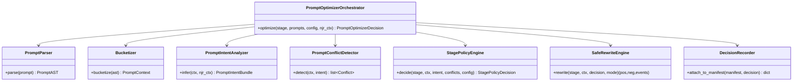

# StableNew2 Prompt Optimizer Deep Research: World‑Class, Safe, Intent‑Aware, Policy‑Driven

## Executive summary

### What I must learn to answer well
I need to understand how prompts currently flow from PromptPack → NJR → executor stages, where prompt mutation already happens (global positive/negative merges, aesthetic injection, adaptive refinement prompt patch, optimizer), how the existing optimizer splits/classifies/dedupes/reorders prompt chunks, how per‑stage configs are represented and applied (txt2img/img2img/ADetailer/upscale/video), and what metadata is already written for replay so the new optimizer can be deterministic, safe, and auditable without breaking existing manifests. fileciteturn172file0L1-L1 fileciteturn175file0L1-L1 fileciteturn174file0L1-L1

### Core conclusions
StableNew already has a **Prompt Optimizer v1** that is primarily a **prompt formatter**: it splits on commas while respecting nesting, classifies into buckets using default keyword sets, optionally dedupes, and then rejoins in a bucket order (with embedding tokens prefixed and LoRA tokens forced to the end). fileciteturn162file0L1-L1 fileciteturn165file0L1-L1 fileciteturn161file0L1-L1

That v1 optimizer is already wired into runtime stage execution (txt2img/img2img/ADetailer, and effectively into the overall generation pipeline), and it already writes a prompt optimization record into stage manifests. fileciteturn174file0L1-L1 fileciteturn170file0L1-L1

However, “world‑class” requirements (never introducing unwanted content, inferring intent and producing structured context, selecting safe per‑stage configs without overriding explicit choices, producing replay‑grade decision metadata, and supporting automated tuning) require **a larger architecture** than the current formatter can provide. In particular, v1’s dedupe behavior can unintentionally change meaning (notably for LoRA tokens and weighted tokens), some config flags are presently unused/no‑ops, and there is no formal “intent → policy → stage config patching” contract. fileciteturn168file0L1-L1 fileciteturn161file0L1-L1

The best path is to **upgrade Prompt Optimizer into a deterministic Policy Engine** that has two distinct modes:
- a **strict “format-only” mode** that is provably non‑semantic (safe by default, never adds content, never changes weights/LoRAs unless explicitly allowed),
- and an **intent/policy mode** that produces **structured context + per‑stage recommendations**, and only applies patches to config fields that are explicitly declared “AUTO” or missing (never overriding explicit values).

Because your web search is disabled in this environment, I am not able to cite external sources for “best practice” surveys; that section below is based on engineering patterns and what StableNew already implements (layering, manifests, contract-driven execution). The repo citations are complete and primary for the current behavior.

## Current StableNew prompt subsystem analysis

### Where prompt optimization already runs
The pipeline executor invokes the prompt optimizer as part of stage assembly. It reads `config["prompt_optimizer"]`, builds a `PromptOptimizerConfig`, runs `PromptOptimizerService`, logs result, and (depending on config) writes a `.prompt_optimization.json` sidecar next to the manifest. fileciteturn174file0L1-L1 fileciteturn160file0L1-L1 fileciteturn170file0L1-L1

This is important for the new design: you already have the right *insertion point* (per-stage, close to payload creation) and a replay-friendly habit (write decision artifacts). The upgrade should preserve that seam but strengthen contracts and safety.

### What the existing optimizer actually does
The SDXL prompt optimizer:
- splits prompts into comma-separated chunks, respecting parentheses/brackets/angle brackets so LoRA syntax and weighted groups don’t break parsing, fileciteturn162file0L1-L1
- classifies each chunk by polarity using default rules, either rule-based or score-based, fileciteturn165file0L1-L1 fileciteturn164file0L1-L1
- extracts `<embedding:...>` references and prefixes them, while also extracting `<lora:...>` tokens (positive only) and placing them at the end of the prompt, fileciteturn161file0L1-L1
- optionally dedupes across buckets using a “dedupe key” that strips cosmetic wrappers and also collapses LoRA tokens to `lora:<name>` (weight not included), fileciteturn166file0L1-L1
- returns “before/after” prompt strings plus bucket mapping and dropped duplicates. fileciteturn163file0L1-L1

The service wrapper validates config, supports opt‑out by pipeline name, and has a helper `optimize_with_config` that fails open by returning unchanged prompts on config or runtime errors. fileciteturn160file0L1-L1

### Gaps and risks relative to “world‑class” requirements
The key gaps are structural and safety-related:

- **Risk: semantic changes via dedupe keys.** The dedupe key collapses LoRA tokens by name only (`lora:<name>`), which means `<lora:foo:0.8>` and `<lora:foo:1.1>` are treated as duplicates and one can be dropped, changing output behavior. The dedupe key also strips weight wrappers sometimes, which can collapse intentionally weighted tokens. fileciteturn166file0L1-L1 fileciteturn161file0L1-L1

- **Config fields are partially unused.** `preserve_lora_relative_order` and `preserve_unknown_order` exist in config defaults and GUI, but v1’s join strategy forces LoRAs to the end and reorders by bucket order, which can discard “preserve unknown order” expectations. `_apply_subject_anchor_boost()` is currently a no‑op. fileciteturn168file0L1-L1 fileciteturn161file0L1-L1 fileciteturn176file0L1-L1

- **No intent contract.** The optimizer produces buckets, but there is no formal `PromptIntent` / `PromptContext` object that downstream tools can consume. Intent config exists in NJR (`intent_config`) and is layered via `config_contract_v26`, but prompt intent and optimizer decisions are not recorded there today. fileciteturn173file0L1-L1 fileciteturn175file0L1-L1

- **No per-stage policy engine.** The executor currently applies plenty of stage logic (global negative merging, aesthetic injection, adaptive refinement patching, and then prompt optimization), but “policy selection” (cfg/sampler tuning, ADetailer knobs, upscale knobs, LoRA/embedding policies) is not carried by a dedicated audited component. fileciteturn174file0L1-L1

- **Safety properties are implicit, not enforced.** The optimizer does not add tokens today, which is good, but there is no `DeltaGuard` that asserts “no new content tokens introduced,” nor tests that enforce fail‑open behavior in every call site. fileciteturn174file0L1-L1

### PromptPack/NJR hooks you can leverage
PromptPack → NJR construction already populates:
- `record.positive_prompt`, `record.negative_prompt`,
- `record.positive_embeddings`, `record.negative_embeddings`, and `record.lora_tags`,
- and also a canonical `intent_config` using `canonicalize_intent_config(...)` with an `adaptive_refinement` section. fileciteturn172file0L1-L1

This is ideal: a world-class optimizer should treat the prompt text as *one input*, but also treat “LoRA tags and embedding tags chosen via UI” as structured inputs that must not be silently dropped or rearranged in a meaning-changing way.

## Best-practice system patterns for safe prompt optimization

Because web search is disabled here, I can’t provide external citations. This section summarizes primary architecture patterns that are consistent with your current StableNew direction (contract-driven execution, per-stage manifests, deterministic replay):

### Four common “prompt optimizer” layers
A world-class system is rarely a single function. It’s usually a pipeline of:

- A **Prompt Parser/Compiler** that produces a stable internal representation (chunks, special tokens, weights, provenance).
- An **Intent Analyzer** that converts prompt + PromptPack/NJR metadata into a structured “intent bundle.”
- A **Policy Engine** that maps intent + environment signals into per-stage decisions (recommendations and/or auto patches).
- A **Safety/Delta Guard + Recorder** that enforces non-surprising behavior, records what happened (and why), and fails open.

### Approaches and tradeoffs
Rule-based intent analyzers are deterministic and explainable (good for replay). ML classifiers can learn better boundaries (good for scaling), but can be less debuggable. Hybrid approaches typically win: start rule-based + heuristics, add learned models behind feature flags only when you have enough telemetry.

In StableNew terms: keep the default “always safe” path deterministic and explainable, and introduce learning in a separate, explicitly versioned layer that can be disabled without breaking outputs.

## Target Prompt Optimizer architecture for StableNew

### Design goals translated into enforceable invariants
To meet your (1)–(5) requirements, the optimizer should guarantee:

- **Invariant: never break a run.** Any optimizer error must fall back to unchanged prompts and no config mutation (fail-open).  
- **Invariant: no surprise content injection.** By default, optimizer must not add content-bearing tokens; any optional additions must be from an allowlist and require explicit opt-in.
- **Invariant: never override explicit user decisions.** Config mutation only applies to keys that are missing OR explicitly marked “AUTO” (or a similar sentinel), and you still record what you would have done otherwise.
- **Invariant: replay is first-class.** Every decision includes version/inputs/rationale and is written into stage manifests.
- **Invariant: structured outputs exist.** Every stage gets a typed `PromptContext` and `PromptIntentBundle` even if prompt text is unchanged.

### Proposed component layout and file paths
Create a new prompting subsystem that makes the optimizer feel like a product feature—not a utility:

- `src/prompting/contracts.py`
- `src/prompting/prompt_ast.py`
- `src/prompting/intent/prompt_intent_analyzer.py`
- `src/prompting/conflicts/prompt_conflict_detector.py`
- `src/prompting/policy/stage_policy_engine.py`
- `src/prompting/rewrite/safe_rewrite_engine.py`
- `src/prompting/decision/prompt_optimizer_orchestrator.py`
- `src/prompting/decision/decision_recorder.py`

You keep your existing bucketizer/deduper/splitter, but you harden them and move them under a stricter contract.

### Data contracts (StableNew style)
Below is the minimal set of dataclasses you want so downstream systems (ADetailer, upscaler, SVD, Comfy/LTX) can consume structured context.

```python
from __future__ import annotations

from dataclasses import dataclass, field
from typing import Any, Literal

StageName = Literal["txt2img", "img2img", "adetailer", "upscale", "animatediff", "svd_native", "video_workflow"]

@dataclass(frozen=True, slots=True)
class PromptSourceContext:
    prompt_pack_id: str | None
    prompt_pack_row_index: int | None
    prompt_source: Literal["pack", "gui", "replay", "learning"]
    run_mode: Literal["DIRECT", "QUEUE"] | None
    tags: list[str] = field(default_factory=list)

@dataclass(frozen=True, slots=True)
class PromptSpecialTokens:
    loras: list[dict[str, Any]] = field(default_factory=list)       # parsed <lora:name:weight>
    embeddings: list[dict[str, Any]] = field(default_factory=list)  # parsed <embedding:name:weight>

@dataclass(frozen=True, slots=True)
class PromptContext:
    positive_original: str
    negative_original: str
    positive_chunks: list[str]
    negative_chunks: list[str]
    buckets_positive: dict[str, list[str]]
    buckets_negative: dict[str, list[str]]
    specials: PromptSpecialTokens
    stats: dict[str, Any] = field(default_factory=dict)

@dataclass(frozen=True, slots=True)
class PromptIntentBundle:
    # Keep this compact + explainable in v1; expand later.
    subject: dict[str, Any] = field(default_factory=dict)        # e.g., {"type":"person","count":1}
    composition: dict[str, Any] = field(default_factory=dict)    # e.g., {"shot":"full_body","distance":"medium"}
    style: dict[str, Any] = field(default_factory=dict)          # e.g., {"mode":"photoreal","medium":"photo"}
    safety: dict[str, Any] = field(default_factory=dict)         # e.g., {"nsfw":true, "explicitness":"high"}
    constraints: dict[str, Any] = field(default_factory=dict)    # e.g., {"pose":"over_shoulder", "risk":"high"}

@dataclass(frozen=True, slots=True)
class StagePolicyDecision:
    stage: StageName
    applied: dict[str, Any] = field(default_factory=dict)        # actual config mutations you applied
    recommended: dict[str, Any] = field(default_factory=dict)    # what you recommend but did not apply
    rationale: list[str] = field(default_factory=list)           # human-readable reasons
    warnings: list[str] = field(default_factory=list)

@dataclass(frozen=True, slots=True)
class PromptOptimizerDecision:
    version: str
    stage: StageName
    mode: Literal["format_only", "recommend", "auto_safe"]
    positive_final: str
    negative_final: str
    context: PromptContext
    intent: PromptIntentBundle
    policies: list[StagePolicyDecision] = field(default_factory=list)
    safety_events: list[dict[str, Any]] = field(default_factory=list)
    errors: list[dict[str, Any]] = field(default_factory=list)
```

This structure aligns with what you already store as prompt optimization sidecars, but expands it into a replay-grade decision bundle instead of just “before/after/buckets.” fileciteturn170file0L1-L1

### Mermaid: data flow in the upgraded optimizer

```mermaid
flowchart LR
  IN[Stage inputs: prompt + config + NJR intent] --> PARSE[PromptParser/AST]
  PARSE --> BUCKET[Bucketizer + stats]
  BUCKET --> INTENT[PromptIntentAnalyzer]
  INTENT --> CONFLICT[ConflictDetector]
  CONFLICT --> POLICY[StagePolicyEngine]
  POLICY --> REWRITE[SafeRewriteEngine]
  REWRITE --> GUARD[DeltaGuard + Safety checks]
  GUARD --> OUT[Decision: final prompts + config patches + metadata]
  OUT --> MANIFEST[Manifest/sidecar recorder]
```


### Mermaid: class relationships


## Algorithms and heuristics that satisfy safety + usefulness

### Intent extraction (rule-based v1, hybrid-ready v2)
You already bucket tokens into categories like subject/environment/pose_action/composition/camera/style/quality. fileciteturn163file0L1-L1  
A v1 intent analyzer can build on that:

**Composition inference heuristics**
- If positive buckets contain “full body / kneeling / standing / portrait / close-up” from defaults, classify shot type and distance. fileciteturn171file0L1-L1
- If “wide angle / telephoto / 85mm / 35mm / bokeh / shallow depth of field” appear, classify lens and perspective risk. fileciteturn171file0L1-L1
- If prompt includes tokens like “over the shoulder / looking back / bending away” (you can add these to default composition/pose keywords), classify pose complexity as high and flag “anatomy risk.”

**Safety inference**
StableNew already merges “global negative” terms for stages based on pipeline flags. fileciteturn174file0L1-L1  
The intent analyzer should not decide “what content to generate”; it should infer **what the user is trying to get** and flag whether content is likely sensitive based on user-provided tags/pack metadata. Store this in intent bundle and let UI/backends decide what to do.

### Conflict detection (embeddings/LoRAs vs prompt)
You already parse embeddings in PromptPack resolution and the optimizer extracts embeddings and LoRA tokens from raw text. fileciteturn177file0L1-L1 fileciteturn161file0L1-L1

A conflict detector should produce warnings and recommendations, not hard failures:
- **Duplicate LoRA name with different weights**: currently dangerous because dedupe may drop one. New logic: treat as conflict; recommend keeping the last user-specified one or the higher weight; do not auto-drop unless explicitly configured.
- **Style conflicts**: in negatives, `style_blockers` includes “anime/3d/cgi/painting”; if positive contains “anime” but negative contains “anime,” flag conflict and recommend aligning. fileciteturn171file0L1-L1
- **Over-constrained prompt**: if chunk count exceeds threshold, you already warn; extend this into a structured signal that policy engine can use (e.g., lower CFG recommendations). fileciteturn168file0L1-L1 fileciteturn174file0L1-L1

### Per-stage policy selection without overriding explicit choices
StableNew already builds a stage chain and passes per-stage configs, and the executor uses fallbacks when keys are missing. fileciteturn172file0L1-L1 fileciteturn174file0L1-L1  
This is exactly how to meet requirement (3): **only fill missing keys** (or keys explicitly marked `AUTO`), never override present values.

**Example: ADetailer policy heuristics**
You already assemble ADetailer payload with fallback defaults if keys are missing. fileciteturn174file0L1-L1  
Add a policy selector:

- If intent says `shot=close_up` or `portrait`, recommend:
  - lower confidence threshold (detect more faces),
  - slightly higher padding,
  - keep denoise low (avoid identity drift).

- If intent says `shot=full_body` + `distance=far` (or pose complexity high):
  - recommend disabling face ADetailer or raising confidence and shrinking “top-k largest” behavior, because tiny faces are unreliable and can cause bad inpainting artifacts.

**Example: Upscale policy heuristics**
Your upscale stage supports both “single” upscaling and “img2img mode” upscaling with denoise. fileciteturn174file0L1-L1  
If prompt complexity is high, recommend conservative denoise and steps to avoid anatomical drift; if prompt is stable, allow slightly higher denoise for texture.

**Example: CFG/sampler**
You already keep sampler/scheduler normalization and stage payload assembly in executor. fileciteturn174file0L1-L1  
Policy engine should:
- never rewrite user sampler if explicitly set,
- but can recommend small CFG adjustments if prompt is overconstrained (too many conflicting chunks) or if pose risk is high.

### Safe rewrite rules and the “Delta Guard”
To satisfy “never introduces errors or unwanted content,” you need explicit guardrails.

**Default safe rewrite (format_only)**
- Don’t add tokens.
- Don’t remove tokens except exact duplicates **only when identical text matches** (not “dedupe key” normalization).
- Don’t collapse LoRA tokens by name; treat full token string as the identity key.
- Don’t change weights.
- Only normalize whitespace and comma spacing (cosmetic).
- Preserve user ordering unless the user opts into “organize.”

This is stricter than current behavior, but you can preserve current bucket reordering behind an opt-in mode. Current behavior reorders by bucket order and moves LoRAs to the end. fileciteturn161file0L1-L1

**Delta Guard**
Before returning “final prompts,” compute a diff classification:
- additions,
- deletions,
- reorders,
- weight changes,
- LoRA/embedding changes.

Then enforce:
- In `format_only`, additions/deletions/weight changes are forbidden.
- In `recommend`, prompt text remains unchanged; only decisions are emitted.
- In `auto_safe`, prompt token changes are still forbidden unless the change is from an allowlisted “non-content stabilizer” set and user opted in.

This guard becomes testable, enforceable, and replayable.

## Manifest metadata and learning loop design

### What you already record
Stage manifests already include `prompt_optimization` records built via `build_prompt_optimization_record(...)`, and the executor can write a `.prompt_optimization.json` sidecar. fileciteturn174file0L1-L1 fileciteturn170file0L1-L1

This is an excellent foundation—extend it into a richer schema.

### Proposed schema additions (JSON examples in StableNew style)
Add a `prompt_optimizer_v3` block to each stage manifest where the optimizer runs:

```json
{
  "prompt_optimizer_v3": {
    "version": "3.0.0",
    "stage": "txt2img",
    "mode": "format_only",
    "inputs": {
      "positive_original": "…",
      "negative_original": "…",
      "prompt_source": {
        "prompt_source": "pack",
        "prompt_pack_id": "An_Extra_T",
        "prompt_pack_row_index": 7,
        "run_mode": "QUEUE",
        "tags": ["portrait", "photoreal"]
      }
    },
    "outputs": {
      "positive_final": "…",
      "negative_final": "…"
    },
    "context": {
      "bucket_counts": { "subject": 3, "composition": 2, "camera_lens": 1 },
      "chunk_counts": { "positive": 14, "negative": 11 },
      "loras": [{"name":"face_refiner","weight":0.8}],
      "embeddings": [{"name":"epiCRealismHelper","weight":0.8}]
    },
    "intent": {
      "composition": { "shot": "full_body", "distance": "medium", "pose_risk": "low" },
      "style": { "mode": "photoreal" },
      "safety": { "sensitive": true, "confidence": 0.7 }
    },
    "policy": {
      "applied": { "adetailer": {}, "upscale": {} },
      "recommended": {
        "adetailer": { "adetailer_confidence": 0.35, "adetailer_padding": 24 }
      },
      "rationale": [
        "Detected medium-distance full-body framing; face ADetailer may be optional."
      ]
    },
    "delta_guard": {
      "added_tokens": [],
      "removed_tokens": [],
      "weight_changes": [],
      "lora_changes": [],
      "status": "pass"
    },
    "warnings": [],
    "errors": []
  }
}
```

This keeps your existing `prompt_optimization` record (for compatibility) but adds a new, versioned, consolidated decision bundle.

### Evaluation & learning loop (grid → Bayesian → bandits)
StableNew’s NJR already supports learning experiment context for routing and metadata correlation. fileciteturn175file0L1-L1  
Use that structure for prompt optimizer tuning too:

1. **Start with deterministic presets** (grid):
   - “format_only”
   - “recommend”
   - “auto_safe_fill_missing_only”

2. **Graduate to Bayesian optimization** once you have enough runs:
   - tune ADetailer confidence/padding/denoise recommendations by shot type and prompt complexity.

3. **Use bandits for online selection** once stable:
   - choose between a small set of policy presets per intent bucket (“portrait”, “full body”, “complex pose”).

**Metrics (practical early set)**
- user rating (thumbs up/down or 1–5),
- re-run rate / manual correction rate (“reroll”, “upscale again”, “ADetailer rerun”),
- prompt complexity stats (chunk count, conflict count),
- stage-specific failure rates (ADetailer artifacts, upscale drift).

### Privacy and retention rules (local-first, replay-safe)
Even in a local app, it’s worth formalizing:
- Store full prompts only in the job manifest required for replay.
- For tuning datasets, store **hashed prompt fingerprints + extracted intent features** rather than raw text unless user opts in to “share for learning.”
- Don’t log full prompts at INFO by default; keep “before/after” under DEBUG or redact sensitive tokens (your optimizer already supports “log_before_after”; change default behavior to safer logging in a future PR). fileciteturn168file0L1-L1 fileciteturn174file0L1-L1

## Tests, CI checks, and implementation plan

### Safety and correctness tests to add
You already have unit tests for prompt optimizer service and SDXL optimizer (by presence in repo). fileciteturn159file4L1-L1 fileciteturn159file5L1-L1  
Add these test categories:

**Unit tests (prompt semantics safety)**
- “LoRA dedupe must not drop different weights.” (New behavior.)
- “Weighted token duplicates are not silently collapsed in format_only.”
- “format_only must never add tokens.”
- “recommend mode must never mutate prompts.”

**Golden file tests (replayability)**
- Given a fixed manifest input, optimizer decision bundle must be deterministic byte-for-byte (minus timestamps).

**Integration tests (executor)**
- If optimizer throws, executor produces unchanged prompts and continues (fail-open).
- Stage manifests include `prompt_optimizer_v3` block when enabled.

### CI architecture guard checks
StableNew already trends toward architectural separation; the prompt optimizer should remain backend-agnostic and not import GUI modules. Enforce with a simple import-graph test:
- `src/prompting/**` must not import `src/gui/**`.
- `src/prompting/**` must not import backend adapters/clients.

This matters especially because GUI already imports prompting modules for preview. fileciteturn176file0L1-L1

### Prioritized implementation plan (PRs + concrete edits)

#### PR 1: Harden Prompt Optimizer v1 into “format_only” and fix semantic-risk dedupe
**Files**
- `src/prompting/prompt_normalizer.py` (change dedupe key behavior)
- `src/prompting/prompt_deduper.py` (dedupe policy)
- `src/prompting/sdxl_prompt_optimizer.py` (stop collapsing LoRA weights; preserve order options)
- `tests/unit/test_sdxl_prompt_optimizer.py` (new cases)

**Key diffs**
- Change LoRA dedupe key from `lora:<name>` to `lora:<name>:<weight>` (or full token string).
- Do not strip weight wrappers in dedupe key by default.
- Implement config flags:
  - `preserve_unknown_order` should keep unknown chunks in original order instead of forced bucket ordering.
  - `preserve_lora_relative_order` should keep LoRAs in-place or at least preserve relative order without dropping.

This directly addresses the “never introduce errors/unwanted changes” requirement by making the default behavior conservative. fileciteturn166file0L1-L1 fileciteturn161file0L1-L1

#### PR 2: Add `PromptOptimizerOrchestrator` + `PromptIntentAnalyzer` (recommend-only)
**Files (new)**
- `src/prompting/decision/prompt_optimizer_orchestrator.py`
- `src/prompting/intent/prompt_intent_analyzer.py`
- `src/prompting/contracts.py`

**Wire-in**
- Update executor `_run_prompt_optimizer` to call orchestrator and receive:
  - final prompts (still unchanged in recommend-only),
  - a decision bundle to write into manifest.

This adds intent inference and structured context without yet changing prompts or configs.

#### PR 3: Add `StagePolicyEngine` that only fills missing keys (auto-safe)
**Files (new)**
- `src/prompting/policy/stage_policy_engine.py`
- `src/prompting/conflicts/prompt_conflict_detector.py`

**Wire-in**
- In executor stage assembly, before building payload:
  - call orchestrator,
  - apply policy `applied` patches **only** when keys are absent.

This meets: “auto-select safe per-stage configs” while respecting explicit user values (because you only touch missing keys).

#### PR 4: Manifest schema v3 + replay tests
**Files**
- `src/prompting/decision/decision_recorder.py` (new)
- Update manifest writers to include `prompt_optimizer_v3`
- Add `tests/system/test_prompt_optimizer_replay_contract.py`

This makes the feature replayable and learnable.

#### PR 5: Learning loop scaffolding (ratings + tuning hooks)
**Files**
- `src/services/ratings_service.py` (new) or integrate with existing learning context
- `src/prompting/tuning/policy_tuner.py` (new)

Ship as opt-in; start with grid presets; store results in a stable local dataset.

### Reviewer checklist (short)
- Optimizer defaults are **format_only** and cannot add content tokens.
- Any optimizer error fails open: unchanged prompts, no config mutation.
- Config mutation only occurs for missing/AUTO keys; explicit values remain untouched.
- `prompt_optimizer_v3` decision bundle is written to manifests and is deterministic.
- Prompting modules do not import GUI or backend clients; CI guard tests cover it. fileciteturn176file0L1-L1

### Suggested .md filenames for outputs
- `docs/design/PromptOptimizer_WorldClass_v3_Design.md`
- `docs/design/PromptOptimizer_PolicyContracts_and_ManifestSchema_v3.md`
- `docs/implementation/PromptOptimizer_v3_PR_Plan_and_Checklists.md`