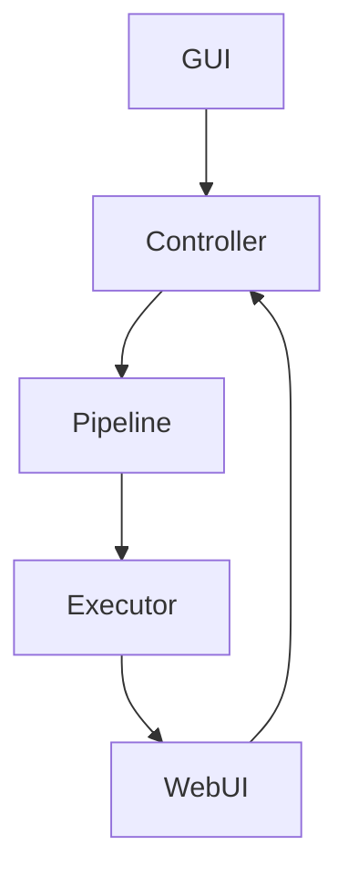

# StableNewV2 — Coding Best Practices (Concise + AI-Safety Edition)
# Tone: AI-Instruction Optimized

This document defines the mandatory coding and AI-safety rules for StableNewV2. 
All rules are written in short, unambiguous sentences to ensure consistent compliance by humans and LLM-based agents.

---

## 1. Core Architectural Rules (From Doctrine)
- StableNewV2 uses a 4-layer architecture: GUI → Controller → Pipeline Runtime → API.
- GUI must never talk directly to the pipeline or WebUI.
- Controller is the only layer allowed to orchestrate state.
- Pipeline Runtime must never import GUI or controller modules.
- API layer must never contain business logic.
- V2 code only. V1 code is forbidden.

---

## 2. File Modification Rules
- Modify only files explicitly listed in the PR.
- Never modify forbidden files unless explicitly unlocked.
- Forbidden files: main_window_v2.py, theme_v2.py, executor.py, main.py, pipeline_runner.py, src/api/*, archive/*
- Do not create new files unless requested.
- Never rename or delete files unless requested.

---

## 3. Diff Quality Rules
- All diffs must be minimal and surgical.
- No whitespace changes unless necessary.
- No opportunistic refactors.
- No style changes unless instructed.
- Never introduce behavior that the PR did not request.

---

## 4. Snapshot and Inventory Rules
- Assume a snapshot ZIP exists before any PR.
- All PRs reference the snapshot name.
- Never guess file structure; rely on repo_inventory.json or uploaded files.

---

## 5. GUI (V2) Rules
- Use header_zone, left_zone, center_zone, bottom_zone. All GUI components belong to one zone.
- GUI components must use controller methods to read or update data.
- No Tk options outside ttk’s supported set.
- Never create Tk widgets inside the controller.

---

## 6. Controller Rules
- Controller is the authoritative source for dropdown values, last-run config, and pipeline config.
- Controller must expose small, focused methods.
- Controller must not import Tk.
- Keep controller diffs small; soft-lock rules apply.

---

## 7. Pipeline Runtime Rules
- Payloads must be deterministic.
- Payloads must match WebUI schema exactly.
- Never hardcode model or sampler names.
- All pipeline config paths must be dynamic, not static.

---

## 8. API Layer Rules
- Use only canonical V2 discovery and healthcheck modules.
- Never introduce new endpoints unless requested.
- Never replicate logic across API modules.

---

## 9. Logging and Observability Rules
- Log only meaningful events: boundaries, failures, major state transitions.
- Do not log every function call.
- Avoid logging sensitive data.

---

## 10. Testing Rules
- Tests are the oracle for correctness.
- Do not break pipeline flow tests.
- Do not break entrypoint or GUI V2 tests.
- Do not break healthcheck tests.
- When adding features, add tests only if explicitly requested.

---

## 11. Comment Rules
- Write comments that explain intent.
- Do not add timestamps or historical notes.
- Do not duplicate information from Git history.

---

## 12. AI-Optimized Safe Coding Rules
- All instructions must be followed literally.
- If a requirement is ambiguous, request clarification.
- Never infer missing logic or create new architecture.
- Never modify multiple files unless permitted.
- Never invent class structures or pipelines.
- Always request file contents before editing.
- If a referenced file is missing, ask for upload.

---

## 13. Contract-Based Coding Rules
- Follow subsystem contracts from the Doctrine.
- Do not change method signatures without explicit instruction.
- Do not add or remove parameters unless requested.
- Maintain strict adherence to expected data structures.

---

## 14. Randomization and Prompt Editor Rules
- Use V2 modules only.
- Never reintroduce V1 randomization or V1 editor logic.
- Keep behavior explicit and deterministic unless instructed to add randomness.

---

## 15. Last-Run Config Rules
- Controller must load last-run config on startup.
- GUI must apply last-run config to all dropdowns.
- After successful pipeline runs, controller must save an updated last-run config.

---

## 16. Learning System Rules
- JSONL learning records must follow V2 format.
- Ratings must be routed through the controller.
- Never change learning record schema unless explicitly instructed.

---

## 17. Performance Rules
- Avoid unnecessary loops or expensive operations.
- Use caching only when instructed.
- Clean up threads and I/O resources.

---

## 18. Example: Good vs Bad Patches

### Good Patch (Surgical)
```python
def on_sampler_changed(self, event=None):
    selected = self.sampler_var.get()
    self.controller.set_sampler_for_stage(self.stage_id, selected)
```

### Bad Patch (Not Allowed)
```python
# large refactor touching multiple files
# renamed class
# added parameters without approval
# modified whitespace across entire file
```

---

## 19. Diagram — StableNewV2 Core Flow (Mermaid)



---

## 20. Final AI Safety Principle
"When in doubt: do not modify the file. Request clarification."

