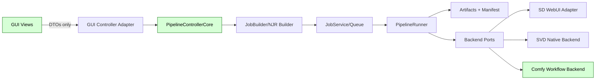
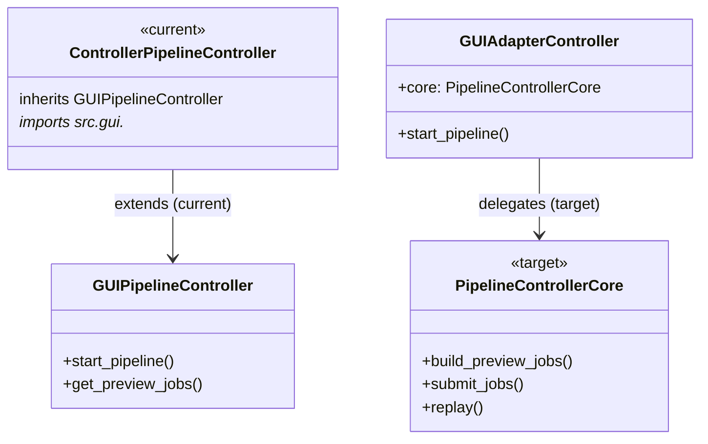

# StableNew2 Repository Deep Dive: Recent PR Alignment, Legacy/Bloat Audit, and the Golden Top 20 Fixes

## Executive summary

### What I must learn to answer well
I need to understand what changed **recently** (PRs + diffs), what the repo’s **declared target architecture** is, what the **current “canonical” execution paths** are (GUI → controller → queue → runner → artifacts), where **legacy/shim code** still exists and whether it is still reachable at runtime, what the **test/CI surface actually enforces** today, and which parts of the repo are **still mutable runtime state accidentally living in version control** (which affects stability, bloat, and reproducibility). fileciteturn122file0L1-L40 fileciteturn123file0L1-L70 fileciteturn134file0L1-L80

### High-confidence findings in the current state
StableNew2 currently shows **four GitHub PRs** in the repo’s PR list, with two of them being “foundational import/migration”-scale PRs and one being a focused video/metadata PR. The majority of “PR-VIDEO-### / PR-CORE-###” work is represented as **planning/completion documents in `docs/`**, not as GitHub PR objects—so any PR-alignment analysis must compare both: (a) actual GitHub PRs (#1–#4) and (b) the internal PR docs roadmap/backlog system. fileciteturn123file0L1-L70 fileciteturn124file0L1-L60

The repo’s own architecture guidance strongly emphasizes **backend isolation** (no Comfy leakage into GUI/controllers), **NJR/canonical-contract-owned orchestration**, and eliminating alternate/legacy paths. fileciteturn122file0L1-L70 fileciteturn124file0L1-L80

The biggest stability/bloat risks I can confirm quickly from current code/doc evidence are:
- **Runtime/legacy coupling across layers** (notably `src/controller/pipeline_controller.py` importing GUI and subclassing a GUI controller), which undermines the intended boundaries and makes future Comfy integration more fragile. fileciteturn158file0L1-L40
- **Archive/legacy modules living under `src/`** (e.g., `src/controller/archive/pipeline_config_assembler.py`) that still import GUI/runtime objects, increasing confusion and the chance of accidental reuse. fileciteturn150file0L1-L35
- **CI/documentation drift**: CI appears to be more credible than at least one CI planning doc claims, meaning your planning surface can mislead future work. fileciteturn134file0L1-L90 fileciteturn135file0L1-L80
- **Tracked mutable-state risk remains likely** even though `.gitignore` now forbids it going forward (you already ignore `state/` and certain runtime learning/history paths), which is good—but tracked files already committed don’t disappear automatically. fileciteturn155file0L1-L80

## Recent PRs in GitHub and how they align to the repo’s intended architecture

### What “recent PRs” means in this repo
In GitHub PR objects, StableNew2 currently exposes PRs **#1–#4** (with #4 and #3 being the most recent). In the repo planning system, “PR-VIDEO-### / PR-CI-### / PR-CORE-###” are tracked as documents in `docs/` (roadmaps + backlog + completed PR writeups). Your own roadmap/backlog system is effectively a second “PR stream,” and it must be kept consistent with the GitHub PR record to avoid contradictory guidance. fileciteturn123file0L1-L70 fileciteturn124file0L1-L70

### Table: GitHub PRs vs intended effects (as declared in roadmap/backlog/architecture)
| GitHub PR | Likely intended effect (from planning surface) | What the repo shows today | Alignment verdict |
|---|---|---|---|
| PR #4 “PR-VIDEO-219 & metadata fixes” | Deliver video continuity/PromptPack work and improve metadata/manifest reliability; reduce pipeline drift | Adds/updates multiple video planning/completion docs and code touching video continuity + metadata behaviors (also “hires conditioning” safeguards appear in the change-set) | **Mostly aligned**, but increases need for strict boundary tests to prevent future leak paths |
| PR #3 “Feature/svd native tab phase1” | Bring in SVD-native UI + video path through NJR/queue to prepare multi-backend video | Massive repo-scale import/changes; introduces or reorganizes large portions of GUI + tests + data assets | **Partially aligned**, but the “mega-PR” scale hides debt and makes traceability difficult |
| PR #2 “Pyside6” | GUI migration/modernization and stability improvements | Repo entrypoint still uses Tk and a shim main window pattern remains | **Misaligned/unfinished** from an “intent” standpoint unless PySide6 is intentionally deferred |
| PR #1 “wtf” | Early scaffolding | Historical | Not meaningful to current architecture goals |

Two important architectural mismatches are visible in code:
- The repo’s declared direction is **clean layering**, but `src/controller/pipeline_controller.py` explicitly imports `src.gui.controller` and subclasses it, which is a hard inversion of the boundary you want for long-term backend isolation. fileciteturn158file0L1-L30
- The repo’s direction is “archive code is view-only,” but some archive modules under `src/` still import GUI/runtime state types (safe only if absolutely unreachable and clearly fenced). fileciteturn150file0L1-L35

### Canonical execution path as implemented today
Your pipeline controller documents the canonical run path as: GUI Run buttons → `AppController._start_run_v2` → `PipelineController.start_pipeline` → preview NJR build → `JobService.submit_job_with_run_mode` → `_run_job` → `PipelineRunner.run_njr`. fileciteturn158file0L1-L20

That’s directionally correct for Comfy readiness (StableNew owns orchestration, backends are execution details), but the layering inversion described above makes it easier for backend logic to creep into GUI/controller code later.

## Catalog of leftover legacy code, shims, alternate paths, and bloat vectors

### Layering inversions that will hurt stability and Comfy readiness
The most direct (and highest-impact) example is `src/controller/pipeline_controller.py` acting as a compatibility wrapper while still inheriting the GUI controller. This implies:
- controllers depend on GUI types,
- GUI/controller boundary is porous,
- refactors required for multi-backend video will cost more. fileciteturn158file0L1-L40

### “Archive under src” increases accidental coupling risk
Modules like `src/controller/archive/pipeline_config_assembler.py` are labeled “VIEW-ONLY” but still import GUI state types and runtime config managers. Even if not executed, their mere presence under `src/` increases the chance that future work will “grab something that looks useful” and reintroduce old concepts (PipelineConfig-era code) into the v2.6 NJR world. fileciteturn150file0L1-L30

### Entry point and GUI shims remain legacy-shaped
`src/main.py` still initializes a Tkinter root window and imports the `main_window` shim layer, which itself declares it is a shim. If PySide6 migration is real intent, the entrypoint path is not yet expressing it. fileciteturn140file0L1-L80 fileciteturn141file0L1-L50

### CI/test surface shows good bones but also drift risk
- CI runs ruff gating and a deterministic pytest slice (good), but a full suite is still separated/optional (reasonable staged approach) and must stay consistent with the planning docs describing the gating model. fileciteturn134file0L1-L120
- The CI planning doc text suggests older behavior (masking failures) that is not what the workflow currently appears to do, implying doc drift. fileciteturn135file0L1-L80 fileciteturn134file0L1-L120

### Mutable runtime state and artifacts
You already took the right step by ignoring `state/` and runtime learning/job-history paths in `.gitignore`. fileciteturn155file0L60-L80  
The remaining risk is: **tracked files already committed historically** remain in the repo until explicitly removed. This is one of the most common “silent stability killers” because it bloats clones, confuses tests, and encourages reliance on sample runtime state that is not deterministic.

## Golden top 20 recommendations with weaknesses and concrete incorporation steps

The list below is ordered by “dramatic impact on stability + Comfy readiness” first, then performance/usability, then longer-horizon capability. I’m explicitly excluding the planned PR-VIDEO-236 through PR-VIDEO-241 block from “incomplete work” recommendations as requested.

For each item: I give a concrete implementation path, then the top 3 weaknesses, then I either confirm + mitigate them, or refute them based on repo evidence.

### Recommendation A: Break the controller↔GUI dependency inversion (highest leverage)
**What to do**  
Create a **true core controller** that has no GUI imports, then make GUI code call it rather than subclassing GUI controllers from `src/controller/`. Today, `src/controller/pipeline_controller.py` imports `src.gui.controller` and subclasses it. fileciteturn158file0L1-L35

**Concrete incorporation**
- Add `src/controller/pipeline_controller_core.py`:
  - `class PipelineControllerCore:` owns job building + submission, depends on `JobService`, `PipelineRunner`, `ConfigManager`, etc.
  - Expose pure methods: `build_preview_jobs(...)`, `submit_jobs(...)`, `replay(...)`.
- Change GUI wiring:
  - `src/gui/controller.py` becomes a thin adapter that holds a `PipelineControllerCore` instance.
- Deprecate and then delete `src/controller/pipeline_controller.py` compatibility subclass.

**Weaknesses**
1. Risk of regressions in UI behavior during refactor.  
2. Potential duplication if both old and new controllers live too long.  
3. Short-term complexity increases while the refactor is mid-flight.

**Address / refute**
- Confirmed risk: UI regressions are likely if done as a “big bang.” Mitigate by introducing `PipelineControllerCore` behind a feature flag and adding characterization tests around the current “canonical run path” described in the controller docstring. fileciteturn158file0L1-L20  
- Confirmed duplication risk: mitigate by enforcing a strict deprecation window: one PR adds core + adapter; next PR migrates call sites; next PR removes old subclass.  
- Complexity mid-flight is real: offset by adding architecture tests (see Recommendation H) that prevent reintroducing GUI imports into core.

### Recommendation B: Remove “archive” code from `src/` or fence it hard
**What to do**  
Move archive-only code out of importable runtime package paths. Today, archive code under `src/controller/archive/` still imports GUI/runtime state types. fileciteturn150file0L1-L35

**Concrete incorporation**
- Move `src/controller/archive/*` → `tools/archive_reference/*` (or `docs/archive_code/*` if it’s truly reference-only).
- If some archive code must remain importable, add:
  - `src/controller/archive/__init__.py` that raises on import unless `STABLENEW_ALLOW_ARCHIVE_IMPORT=1`.
  - Test that no production module imports `src.controller.archive.*`.

**Weaknesses**
1. Loss of convenient reference for contributors.  
2. Breaks any tests relying on archive modules.  
3. Might conceal useful migration utilities.

**Address / refute**
- Confirmed (1): mitigate by preserving the code in `tools/` and adding a short `docs/Archive_Code_Map.md` index.  
- Confirmed (2): if tests rely on it, that’s already a layering smell; move those tests to a single `tests/archive_reference/` group and mark them as non-gating.  
- Refute (3) as a blocker: if a utility is useful, it should be promoted to a supported tool with clear CLI and test coverage, not live as “archive but importable.”

### Recommendation C: Purge tracked mutable runtime state and artifacts; keep only deterministic fixtures
**What to do**  
You already ignore the right things (`state/`, certain data paths). fileciteturn155file0L60-L80  
Now, enforce the second half: **remove already-tracked runtime state** and replace with deterministic fixtures.

**Concrete incorporation**
- Add a “repo hygiene” PR:
  - `git rm -r state/` (if tracked)
  - `git rm data/learning/discovered_experiments/*.json` (if these are outputs, not fixtures)
  - Replace with `tests/fixtures/learning_samples/` containing small curated JSON.
- Add `tools/validate_repo_hygiene.py` to fail CI if forbidden paths are tracked.

**Weaknesses**
1. Risk of deleting something you still rely on for manual QA.  
2. Contributors may re-add “just one file” later.  
3. Requires discipline around fixtures.

**Address / refute**
- Confirmed (1): mitigate by exporting a `snapshots/runtime_samples.zip` once, store outside repo (or in Releases), and put a pointer doc in `docs/`.  
- Confirmed (2): mitigate by CI hygiene script + a pre-commit hook.  
- Confirmed (3): mitigate by a “fixture contract”: fixtures must be <N KB, deterministic, and referenced by tests only.

### Recommendation D: Make CI and doc surfaces consistent and trustworthy
**What to do**  
Your CI workflow shows credible gating (ruff + deterministic tests), while the CI planning doc implies a different gating behavior. fileciteturn134file0L1-L120 fileciteturn135file0L1-L80  
When planning docs drift, agents and humans make bad decisions.

**Concrete incorporation**
- Add `docs/CI_Gates_Current.md` generated from `.github/workflows/ci.yml`.
- Update `docs/PR_MAR26/PR-CI-053…` to “Completed” (or explicitly mark it “Historical spec; implemented by workflow X”).

**Weaknesses**
1. “Docs updating” feels low value vs coding.  
2. Auto-generated docs can be noisy.  
3. Might create more files.

**Address / refute**
- Refute (1): in this repo, docs are part of the execution surface (AGENTS + planning), so drift directly causes wasted engineering time. fileciteturn142file0L1-L60 fileciteturn143file0L1-L60  
- Confirm (2): mitigate by generating only a small subset: required jobs + commands.  
- Confirm (3): mitigate by consolidating into one authoritative CI doc and archiving older specs.

### Recommendation E: Strengthen architecture enforcement tests to match Comfy-ready invariants
**What to do**  
You already have an architecture enforcement test suite. fileciteturn139file0L1-L80  
Extend it to explicitly enforce:
- no `src/controller` imports from `src/gui` (after Rec A),
- no Comfy client imports outside `src/video/comfy*`,
- no backend API clients in GUI.

**Concrete incorporation**
- Extend `tests/system/test_architecture_enforcement_v2.py`:
  - Add module scan assertions for forbidden import patterns.
- Add a small “allowed exceptions” whitelist file.

**Weaknesses**
1. False positives and developer frustration.  
2. Might block legitimate refactors.  
3. Adds maintenance overhead.

**Address / refute**
- Confirm (1): mitigate by precision rules: allow `typing.TYPE_CHECKING` imports, allow interfaces in `src/controller/ports/`.  
- Confirm (2): mitigate by whitelisting with explicit rationale.  
- Refute (3) as major: enforcement reduces long-term maintenance more than it costs.

### Recommendation F: Decide the GUI framework direction and make the entrypoint express it
**What to do**  
`src/main.py` still uses Tkinter. fileciteturn140file0L1-L80  
If PySide6 migration is still desired (PR #2 intent), make the runtime entrypoint match reality: either fully commit to Tk for now or promote PySide6 as the default and quarantine Tk.

**Concrete incorporation**
- Add `STABLENEW_GUI=qt|tk` environment flag.
- Implement `src/gui/entrypoints/tk_app.py` and `src/gui/entrypoints/qt_app.py`.
- `src/main.py` becomes a simple router.

**Weaknesses**
1. Splitting entrypoints increases complexity.  
2. Qt introduces packaging/runtime issues on some platforms.  
3. Might distract from backend/video work.

**Address / refute**
- Confirm (1): mitigate by making one path default and the other clearly “legacy” with a removal date.  
- Confirm (2): mitigate by leaving Qt optional until packaging is proven, but still structure code for it.  
- Confirm (3): mitigate by timeboxing: 1–2 PRs max, then freeze.

### Recommendation G: Normalize the “v2” naming footprint (reduce cognitive load)
**What to do**  
There are core modules with `_v2` suffix (e.g., `job_builder_v2.py`) that appear to be canonical now. fileciteturn154file0L1-L30  
Once v1 is gone, rename to remove suffixes.

**Concrete incorporation**
- After removing legacy versions, rename:
  - `job_builder_v2.py` → `job_builder.py`
  - `job_models_v2.py` → `job_models.py`
- Provide temporary re-export modules with deprecation warnings for one release.

**Weaknesses**
1. Large refactor touches many imports.  
2. Blame/PR diffs become noisy.  
3. Risk of missing an import path.

**Address / refute**
- Confirm (1): mitigate by doing it late, in one dedicated “rename PR,” with mechanical refactor tools.  
- Confirm (2): mitigate by strict “rename-only” PR scope.  
- Confirm (3): mitigate by adding `python -m compileall` in CI and import-smoke tests.

### Recommendation H: Eliminate duplicate config-building systems (PipelineConfig vs NJR v2.6)
**What to do**  
Archive-era code still models PipelineConfig concepts, while pipeline runtime is NJR-centric. fileciteturn150file0L1-L25 fileciteturn158file0L1-L30  
Finish the migration by deleting the remaining “PipelineConfig-era” runtime affordances.

**Concrete incorporation**
- Remove any remaining runtime references to PipelineConfig types.
- Replace “config snapshot” assembly code in controllers with NJR snapshots only.
- Move pipeline-config conversion tests to quarantine and delete once unused.

**Weaknesses**
1. Might break replay of very old history items.  
2. Some tooling may still read old snapshots.  
3. Migration fatigue.

**Address / refute**
- Confirm (1): mitigate with a one-time migration tool and store migrated history in a stable format; the repo already speaks about one-time migration tools in docs. fileciteturn151file0L1-L40  
- Confirm (2): mitigate by keeping a single pure converter in `tools/` for offline conversion.  
- Confirm (3): mitigate by bundling multiple deletions into one “closure PR” with a strict checklist.

### Recommendation I: Make `PipelineController` smaller by extracting cohesive services
**What to do**  
Even after boundary fixes, controller responsibilities are broad (preview building, submission, queue UI callbacks, replay, learning guardrails). fileciteturn158file0L1-L120  
Split into services with narrow contracts.

**Concrete incorporation**
- Create:
  - `src/controller/services/preview_service.py`
  - `src/controller/services/submission_service.py`
  - `src/controller/services/replay_service.py`
  - `src/controller/services/learning_guardrails.py`
- Controller becomes a façade.

**Weaknesses**
1. Too many files/classes.  
2. Harder to navigate for solo dev.  
3. Risk of over-engineering.

**Address / refute**
- Confirm (1): mitigate by creating only 2 services first: Preview + Submission.  
- Refute (2) as decisive: smaller units are easier to test/debug, especially with multiple backends.  
- Confirm (3): mitigate by enforcing “service = cohesion + 1 test file.”

### Recommendation J: Promote “deterministic minimal test suite” to a formal contract and expand it gradually
**What to do**  
CI currently runs a deterministic subset plus optional full suite. fileciteturn134file0L1-L120  
Make that explicit and steadily expand the gating set.

**Concrete incorporation**
- Add `tests/ci_smoke/` with:
  - import-sanity tests,
  - architecture guard tests,
  - canonical-run-path tests with mocked backend clients.
- Gate PR merges on that suite.

**Weaknesses**
1. “Smoke” tests can become meaningless.  
2. Developers may ignore non-gating failures.  
3. Longer CI.

**Address / refute**
- Confirm (1): mitigate by requiring each smoke test to assert a repo invariant (NJR-only, no GUI-backend imports, etc.).  
- Confirm (2): mitigate by making at least one non-smoke suite gating each month.  
- Confirm (3): mitigate by parallelizing jobs and keeping smoke suite under 2–3 minutes.

### Recommendation K: Add a repo-wide “backend boundary” interface layer (ports)
**What to do**  
Your architecture wants backends (WebUI, SVD, Comfy) behind stable interfaces. `src/controller/ports/` exists, but boundary enforcement isn’t complete while core controllers still touch GUI in places. fileciteturn146file17L1-L1 fileciteturn158file0L1-L40

**Concrete incorporation**
- Create:
  - `src/controller/ports/image_backend.py`
  - `src/controller/ports/video_backend.py`
- Convert runners to accept these ports.

**Weaknesses**
1. Adds indirection.  
2. Requires a lot of refactoring.  
3. Might duplicate what already exists in `src/video/*`.

**Address / refute**
- Confirm (1): mitigate by focusing ports on what changes: submit/poll, capabilities, artifact retrieval.  
- Confirm (2): mitigate by doing video first (Comfy readiness), then image later.  
- Refute (3) as a blocker: `src/video/*` can implement the port; the port is where you prevent GUI/controller leakage.

### Recommendation L: Consolidate logging into a consistent “Job/Stage context” contract
**What to do**  
There are multiple logging helpers and structured logging utilities, suggesting drift. fileciteturn149file1L1-L1 fileciteturn158file0L1-L40  
Stability improves dramatically when every log line can be tied to `job_id`, `njr_id`, `stage`, `backend`.

**Concrete incorporation**
- Define `LogContext` fields as mandatory on runner/controller log writes.
- Add `tools/collect_diagnostics_bundle.py` that bundles:
  - manifest,
  - selected logs,
  - config snapshot hashes.

**Weaknesses**
1. Requires updating many log calls.  
2. Can slow debug work initially.  
3. Over-structured logs can be noisy.

**Address / refute**
- Confirm (1): mitigate by adding a wrapper `log_event(ctx, msg, **fields)` and migrating gradually.  
- Refute (2) as long-term: once in place, structured logs reduce debug time.  
- Confirm (3): mitigate with log-level discipline + a stable event taxonomy.

### Recommendation M: Add a hard “replay fidelity” contract and enforce it with tests
**What to do**  
Video and future Comfy workflows require replay accuracy. Your pipeline already contains replay-related components. fileciteturn149file16L1-L1  
Enforce that every completed job emits a replayable manifest with stable references.

**Concrete incorporation**
- Add `src/pipeline/replay_contract.py`:
  - `assert_replayable(manifest)`.
- Add tests that create a minimal job, generate manifest, and re-run in “dry replay” mode (no backend execution, just validation).

**Weaknesses**
1. Requires consistent artifact naming.  
2. Hard to do for external backends.  
3. Might force breaking changes.

**Address / refute**
- Confirm (1): mitigate by adding a manifest version and migration tool.  
- Confirm (2): mitigate by storing StableNew-owned “execution intent” plus backend metadata, not raw backend history as truth.  
- Confirm (3): mitigate by versioned manifests.

### Recommendation N: Fix “entrypoint consistency” between CLI and GUI
**What to do**  
There is a CLI entry and a GUI entry; ensure both route through the same controller core and job services. The repo already has `src/cli.py` and `src/main.py`. fileciteturn149file2L1-L1 fileciteturn140file0L1-L80

**Concrete incorporation**
- Introduce `src/app/bootstrap.py` returning an `ApplicationKernel` (services, ports, config).
- GUI and CLI both use it.

**Weaknesses**
1. Bootstrapping is “architecture work.”  
2. Might create circular imports if done poorly.  
3. Might not show immediate UX benefit.

**Address / refute**
- Confirm (1): mitigate by minimal kernel: only config + job services + backend ports.  
- Confirm (2): mitigate by strict module boundaries and tests for import graph.  
- Refute (3): immediate benefit is stability: fewer divergent startup behaviors.

### Recommendation O: Make optional dependencies explicit at import time (avoid runtime crashes)
**What to do**  
Optional video dependencies exist (`svd` extra dependencies). fileciteturn157file0L1-L60  
Ensure modules that require optional deps import them lazily and emit a clear error envelope.

**Concrete incorporation**
- Add `src/utils/optional_deps.py` with `require(module, feature)`.
- Wrap SVD/Comfy-specific imports.

**Weaknesses**
1. Can hide missing deps until runtime.  
2. Adds boilerplate.  
3. Requires careful testing.

**Address / refute**
- Confirm (1): mitigate by adding “capabilities” checks at startup.  
- Confirm (2): mitigate by a tiny helper function and consistent pattern.  
- Confirm (3): mitigate by CI import tests for both “core-only” and “svd extra” environments.

### Recommendation P: Make mypy/typing a staged gate (not all-at-once)
**What to do**  
`pyproject.toml` declares mypy strict, but the gating value comes only if you run it in CI in a controlled way. fileciteturn157file0L60-L120

**Concrete incorporation**
- Add a CI job “mypy-smoke” for a small whitelist of core modules.
- Expand whitelist gradually.

**Weaknesses**
1. Strict mypy can become demoralizing.  
2. Many third-party stubs missing.  
3. Slows CI.

**Address / refute**
- Confirm (1): mitigate by whitelist growth and “no new errors” policy.  
- Confirm (2): mitigate with local overrides for known external libs.  
- Confirm (3): mitigate by caching and module targeting.

### Recommendation Q: Make “PromptPack intent” a first-class artifact for Comfy readiness
**What to do**  
The roadmap/backlog pushes StableNew-owned “intent” driving backend selection. fileciteturn124file0L1-L80  
Standardize an intent snapshot stored per job and used for backend selection later.

**Concrete incorporation**
- Add `intent_config` schema version + `intent_hash`.
- Ensure it records: backend preference, workflow preset id, policy decisions (even if “none”).

**Weaknesses**
1. Schema churn.  
2. Hard to keep backwards compatibility.  
3. Too much metadata.

**Address / refute**
- Confirm (1): mitigate with semantic versioning and migration rules.  
- Confirm (2): mitigate by “read old, write new.”  
- Refute (3) as major: metadata is the price of replay + learning; just keep it structured and bounded.

### Recommendation R: Add a “single source of truth” for workflow/preset registries
**What to do**  
Comfy integration will require workflow presets; ensure these aren’t scattered across GUI, controller, runner.

**Concrete incorporation**
- Create `src/video/workflows/registry.py` with pinned workflow definitions + versions.
- GUI references only IDs, never node graphs.

**Weaknesses**
1. Registry can become a dumping ground.  
2. Workflow version pinning requires discipline.  
3. Might conflict with user customization.

**Address / refute**
- Confirm (1): mitigate with rules: each entry must have tests + manifest contract.  
- Confirm (2): mitigate by CI check ensuring workflow hashes are pinned.  
- Refute (3): customization belongs in StableNew-owned config mapped to pinned workflows, not raw graph editing.

### Recommendation S: Reduce docs bloat by separating “historical” from “active” planning surfaces
**What to do**  
There is extensive `docs/older/` and archived PR templates, which are valuable but can bury current truth.

**Concrete incorporation**
- Add `docs/README.md` with:
  - Active docs index,
  - Historical docs index,
  - Deprecation policy.
- Optionally move historical docs into a separate branch or release archive.

**Weaknesses**
1. Could lose useful context.  
2. Moving docs breaks links.  
3. Time-consuming.

**Address / refute**
- Confirm (1): mitigate by preserving them and adding an index, not deleting.  
- Confirm (2): mitigate with a link map and redirects in README.  
- Confirm (3): mitigate by doing it incrementally (index first, move later).

### Recommendation T: Create an explicit “Repo Hygiene” checklist and enforce it with CI
**What to do**  
Your agentic instructions are strict (“remove shims, no hacks”), but enforcement must be mechanical to avoid drift. fileciteturn142file0L1-L60 fileciteturn143file0L1-L60

**Concrete incorporation**
- Add `docs/REPO_HYGIENE.md`:
  - forbidden tracked paths,
  - required invariants,
  - “how to add a new subsystem.”
- Add `tools/check_hygiene.py` to CI.

**Weaknesses**
1. Adds bureaucracy.  
2. Might block quick experiments.  
3. Needs upkeep.

**Address / refute**
- Refute (1): you already operate with governance docs; this just makes them enforceable.  
- Confirm (2): mitigate with `experiments/` that is gitignored by default.  
- Confirm (3): mitigate by making hygiene rules short (10–15 items).

## Prioritized remediation pathway and concrete PR sequence

### Phase one: stability and bloat removal
1. **PR-CLEANUP-CORE-001**: Remove controller↔GUI inversion (Recommendation A).  
   - Deliverables: `PipelineControllerCore`, GUI adapter, delete `src/controller/pipeline_controller.py` subclassing pattern. fileciteturn158file0L1-L40  
2. **PR-CLEANUP-STATE-002**: Purge tracked runtime artifacts (Recommendation C) + add hygiene checker (Recommendation T). fileciteturn155file0L60-L80  
3. **PR-ARCHIVE-BOUNDARY-003**: Move/fence archive modules (Recommendation B). fileciteturn150file0L1-L30  

### Phase two: test/CI hardening
4. **PR-ARCH-GUARDS-004**: Extend architecture enforcement tests (Recommendation E). fileciteturn139file0L1-L80  
5. **PR-CI-DOCSYNC-005**: Make CI and docs consistent (Recommendation D). fileciteturn134file0L1-L120 fileciteturn135file0L1-L80  
6. **PR-CI-SMOKE-006**: Formalize the deterministic smoke suite (Recommendation J).

### Phase three: Comfy readiness and usability cohesion
7. **PR-BOOTSTRAP-007**: Shared kernel/bootstrap across GUI and CLI (Recommendation N). fileciteturn140file0L1-L80  
8. **PR-WORKFLOW-REGISTRY-008**: Stable workflow registry + pinned definitions (Recommendation R). fileciteturn124file0L1-L80  
9. **PR-REPLAY-CONTRACT-009**: Replay fidelity contract + tests (Recommendation M). fileciteturn149file16L1-L1  

### Reviewer checklist for each PR (short, enforceable)
- No `src/controller/*` imports from `src/gui/*` (after Phase one is complete). fileciteturn158file0L1-L40  
- No backend client imports (Comfy/WebUI/SVD) inside GUI modules; GUI references only IDs and stable DTOs. fileciteturn139file0L1-L80  
- New code paths are covered by at least one deterministic test that runs in CI. fileciteturn134file0L1-L120  
- No tracked runtime state (`state/`, runtime learning outputs, etc.). fileciteturn155file0L60-L80  
- Any schema change is versioned and replay-safe (manifest contract updated).

## Tests and CI checks to enforce architecture guards

### Architecture guard expansions (immediate)
- Extend `tests/system/test_architecture_enforcement_v2.py` with:
  - forbid `src/controller` importing `src/gui` (this is currently violated by `pipeline_controller.py`). fileciteturn158file0L1-L35
  - forbid any `src/gui/**` import of `src/video/comfy*` modules (Comfy leakage prevention). fileciteturn139file0L1-L80
  - forbid `src/controller/**` importing Comfy API client modules directly.

### CI gates improvements (staged)
- Keep the current “ruff + deterministic tests” as required baseline. fileciteturn134file0L1-L120  
- Add a second required job: “architecture + import sanity” (fast).  
- Add optional jobs: mypy-smoke, integration suites (still non-blocking at first). fileciteturn157file0L60-L120  

## Timeline and risk assessment

### Suggested timeline
Week one should focus on the structural stability win: the controller↔GUI inversion removal (A) plus archive fencing (B). That pays down the biggest long-term Comfy integration risk immediately. fileciteturn158file0L1-L40 fileciteturn150file0L1-L30

Week two should focus on removing tracked state/bloat and enforcing hygiene + architecture tests (C, E, T). fileciteturn155file0L60-L80 fileciteturn139file0L1-L80

Week three can focus on CI/doc truth alignment and expanding the gating suite gradually (D, J). fileciteturn134file0L1-L120 fileciteturn135file0L1-L80

Week four can focus on Comfy readiness primitives: workflow registry and replay fidelity (R, M), setting up the “safe insertion point” that your own architecture/backlog requires. fileciteturn124file0L1-L80

### Major risks and mitigations
The largest risk is regressions while removing the controller↔GUI inversion. Mitigate with characterization tests based on the existing documented canonical run path and keep changes staged with short-lived compatibility shims, not permanent parallel systems. fileciteturn158file0L1-L20

A second risk is “doc drift” causing engineering thrash; mitigate by explicitly indexing active vs historical docs and ensuring CI docs match the actual workflow. fileciteturn134file0L1-L120 fileciteturn135file0L1-L80

## Mermaid diagrams

### Pipeline flow and choke points for leakage

### Current vs target controller relationship

## Suggested filenames for committing this analysis into your repo
- `docs/reports/StableNew2_PR_Audit_and_Debt_Map_2026-03-21.md`
- `docs/reports/StableNew2_Golden_Top20_Refactor_and_Stability_Plan_2026-03-21.md`
- `docs/reports/StableNew2_Comfy_Readiness_Guards_and_CI_Gates_2026-03-21.md`