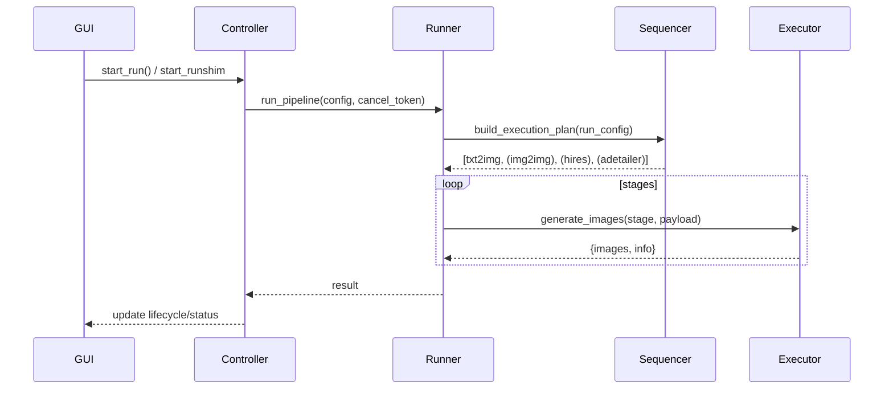
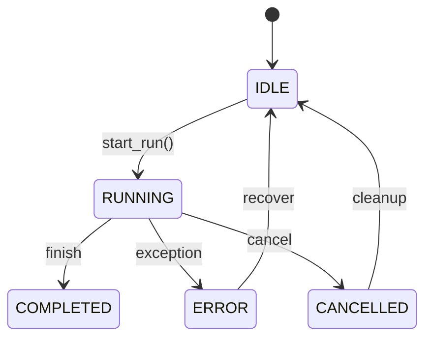
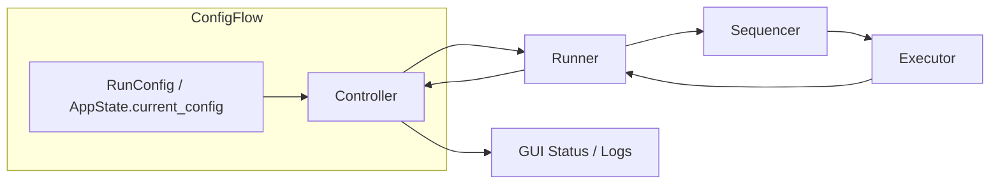

<!-- SPDX-License-Identifier: CC-BY-4.0 -->
# V2.5 Stage Sequencing Framework

## Introduction

The V2.5 staging model defines how GUI V2, the controller, and the pipeline runner collaborate to execute artwork flows. It codifies the supported stages (txt2img, img2img, refiner, hires/upscale, ADetailer), their valid orderings, and the tests that enforce those invariants. This doc is the single source of truth for anyone (engineer or AI agent) working on sequencing logic.

### Purpose

- Surface the canonical stage catalog and the highlighting configuration knobs.
- Clarify the runtime sequencing guarantees (`AT least one generation stage`, `ADetailer always last`, `Refiner/hires before upscale`).
- Map each behavior to the tests that exercise it.

### Relation to V1/V2 designs

V2.5 builds on earlier V1 flows (a single pipeline stage per run) and V2 (stage cards + pipeline runner). It adds a richer stage catalog (refiner + hires-aware txt2img, dedicated upscale metadata, ADetailer at the end) while keeping the safe Controller → PipelineRunner → Executor ordering that V2 introduced.

## Stage Catalog

| Stage | Inputs | Outputs | Key Config | Tests |
| --- | --- | --- | --- | --- |
| `txt2img` | Prompt + RunConfig | Base image(s) in `runs/...` | `model`, `sampler`, `scheduler`, `steps`, `cfg_scale`, `refiner_*`, `hires_fix_*` | `tests/journeys/test_jt03_*`, `tests/pipeline/test_pipeline_runner_variants.py` |
| `img2img` | Base image (from file or previous stage) + prompt override | Transformed image | `prompt`, `denoise`, `cfg_scale`, `seed` | `tests/journeys/test_jt04_*`, `tests/pipeline/test_pipeline_io_contracts.py` |
| `refiner` (embedded in txt2img) | Low-res `txt2img` output | Enhanced low-res image | `refiner_enabled`, `refiner_model_name`, `refiner_switch_at` | `tests/journey/test_v2_refiner_hires_adetailer_sequence.py`, `tests/pipeline/test_pipeline_runner_sdxl_refiner_hires.py` |
| `hires` / `upscale` | Refined image | High-res image ready for ADetailer | `hires_enabled`, `hires_upscale_factor`, `hires_upscaler_name`, `hires_steps`, `hires_denoise`, `upscale_enabled`, `upscale_model`, `upscale_factor` | `tests/journeys/test_jt05_upscale_stage_run.py` |
| `ADetailer` | High-res image | Final stylized image | `adetailer_enabled`, `adetailer_model`, `adetailer_strength` | `tests/journeys/test_jt04_img2img_adetailer_run.py` |

## Canonical Stage Order

1. `txt2img` (with optional refiner/hires metadata)
2. `img2img` (if active)
3. `hires/upscale` (if enabled and not performed inside txt2img)
4. `ADetailer` (always last when enabled)

### Key invariants

- At least one of `txt2img`, `img2img`, or `upscale`/`hires` must be enabled for a run to proceed.  
- `ADetailer` cannot appear before a generation stage; the stage sequencer always moves it to the final slot or rejects the config.  
- Refiner and hires metadata live inside the `txt2img` stage payload (never as standalone stages).  
- Upscale/hires runs share the same fake pipeline paths as normal stages; only the controller config determines if they execute.

## Sequencing Scenarios

- **Txt2img only**: Controller validates prompt/config, runner executes `txt2img`, and lifecycle returns to IDLE.  
- **Img2img only**: `img2img` receives `pipeline_tab.input_image_path` or base image from earlier run; the executor runs a single `img2img` stage.  
- **Txt2img + Img2img**: Output from txt2img (with refiner) becomes input to img2img.  
- **Generation + Refiner/Hires**: Controller sets `refiner_enabled` and/or `hires_enabled` on `RunConfig`; StageSequencer includes the metadata in the txt2img stage before handing it to the executor.  
- **Full chain**: `txt2img` → `img2img` (optional) → `upscale` → `ADetailer` (when toggled) is the most complex path covered by `tests/journeys/test_v2_refiner_hires_adetailer_sequence.py`.

## Error Handling & Validation

- Missing generation stage: controller validation fails early, lifecycle stays in IDLE, and the UI shows “Config Error”.  
- `ADetailer` without preceding stage: `StageSequencer` raises a `RuntimeError` or reorders it to the tail (See `tests/pipeline/test_stage_sequencer_runner_integration.py`).  
- Conflicting stage flags (e.g., two different upscalers): Runner logs the mismatch and transitions to ERROR; tests like `tests/controller/test_app_controller_pipeline_flow_pr0.py` assert lifecycle changes.

## Integration Points

- **RunConfig / AppState**: `current_config` and `app_state.run_config` store the stage toggles. Updates in `PipelineTabFrameV2` propagate to `RunConfig` (see `src/gui/views/pipeline_tab_frame_v2.py`).  
- **Controller**: `AppController.run_pipeline()` builds the pipeline config, updates lifecycle, and delegates to `PipelineRunner` or `SingleNodeJobRunner` (PR-072/074/075).  
- **PipelineRunner & StageSequencer**: The runner calls `build_execution_plan`, loops through `StageExecution` objects, invokes `Pipeline`, and writes outputs. Stage metadata (refiner/hires) travels in `stage.stage_config`.  
- **Executor**: Each stage uses `ApiClient.generate_images(...)` (PR-079A/D/E/G), so tests patch a single method for all stages.

## Tests as Contracts

- **Journies**:  
  - JT03: `tests/journeys/test_jt03_txt2img_pipeline_run.py` ensures txt2img + prompt flow.  
  - JT04: `tests/journeys/test_jt04_img2img_adetailer_run.py` verifies img2img + ADetailer.  
  - JT05: `tests/journeys/test_jt05_upscale_stage_run.py` covers standalone upscale + multi-stage flow.  
  - V2 Full Journey: `tests/journeys/test_v2_full_pipeline_journey.py` ensures controller → runner wiring via `FakePipelineRunner`.
- **Pipeline**:  
  - `tests/pipeline/test_pipeline_runner_variants.py` ensures stage order + async behavior.  
  - `tests/pipeline/test_stage_sequencer_runner_integration.py` validates `StageExecutionPlan`.  
  - `tests/pipeline/test_pipeline_learning_hooks.py` + learning suite confirm stage outputs feed learning hooks via the shared `FakePipeline`.
- **Queue/Controller**:  
  - `tests/controller/test_app_controller_pipeline_flow_pr0.py` checks lifecycle transitions through IDLE/RUNNING/ERROR.  
  - `tests/queue/test_single_node_runner.py` ensures results flow back to `JobQueue`.

## For AI Agents: How to Use This Doc

1. **Stage order**: Refer to *Canonical Stage Order* for invariants and error policies.  
2. **RunConfig knobs**: Each stage lists the keys it needs, so agents can map GUI toggles to payload fields.  
3. **Tests**: Match new behaviors to the listed tests to keep coverage tight and avoid regressions.  
4. **Diagrams**: The Mermaid diagrams below show the runtime flow, so copy/paste them when explaining sequencing in future PRs.

## Diagrams

### V2.5 Run Flow

### Lifecycle & Data Flow

## Future Reading

- [StableNewV2_Inventory_V2-P1.md](StableNewV2_Inventory_V2-P1.md) – broader product summary (see “Pipeline sequencing” references).  
- [High-Level-Reasoning-and-Plan(ChatGPT-11-27-25).md](High-Level-Reasoning-and-Plan(ChatGPT-11-27-25).md) – executive summary, now pointing to this doc for stage-specific guidance.  
- `tests/High-Level-Reasoning-and-Plan` (internal) – contains future coverage/PR plans.
